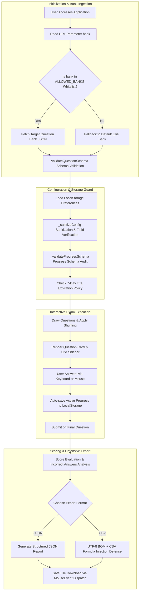
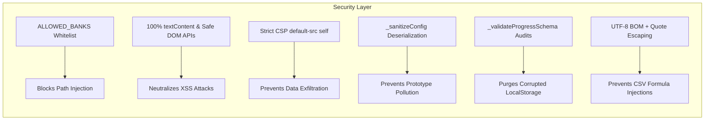
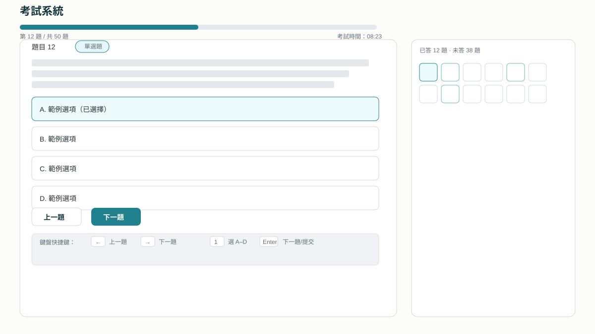
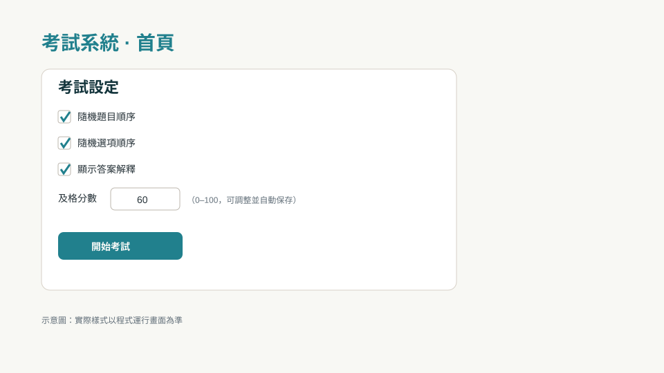
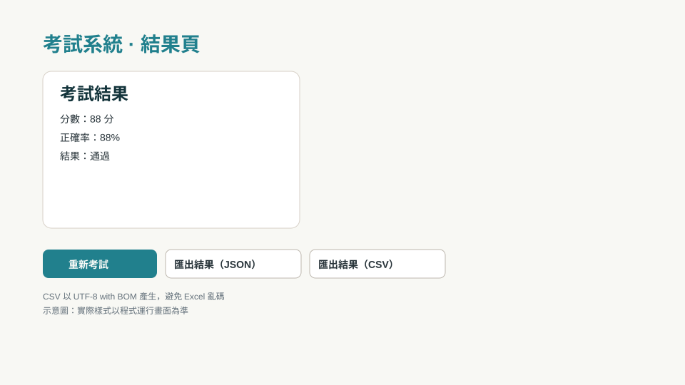

# Examination System

[繁體中文版](README.md)

> A client-side mock examination and knowledge assessment platform featuring isolated question bank loading, custom drawing quantities, automatic progress preservation, real-time analytics, and defensive data exports.

[](CHANGELOG.en.md)
[](LICENSE)
[](CHANGELOG.en.md)
[](https://scorpio-meow.github.io/Examination-System/)
[](https://github.com/Scorpio-meow/Examination-System/issues)
[](https://github.com/Scorpio-meow/Examination-System/pulls)

---

## Table of Contents

- [Quick Start](#quick-start)
- [Live Demo](#live-demo)
- [Architecture & Data Flow](#architecture--data-flow)
- [Features](#features)
- [Available Question Banks](#available-question-banks)
- [Configuration Settings](#configuration-settings)
- [Keyboard Shortcuts](#keyboard-shortcuts)
- [Data Schema & Standards](#data-schema--standards)
- [File Structure](#file-structure)
- [Security & Defensive Architecture](#security--defensive-architecture)
- [Visual Previews](#visual-previews)
- [Troubleshooting](#troubleshooting)
- [FAQ](#faq)
- [Changelog](#changelog)
- [Contribution Guide](#contribution-guide)
- [Contact](#contact)
- [License](#license)

---

## Quick Start

### Online Execution (Recommended)

Directly open [https://scorpio-meow.github.io/Examination-System/](https://scorpio-meow.github.io/Examination-System/) with zero dependencies or installation.

### Local Execution

1. Clone or download the repository:
   ```bash
   git clone https://github.com/Scorpio-meow/Examination-System.git
   cd Examination-System
   ```

2. Start a local static file server (required to bypass browser CORS constraints on the `file://` protocol when fetching JSON files):

   - **Using Bun (Recommended)**:
     ```bash
     bun x http-server -p 8000
     ```

   - **Using Python 3**:
     ```bash
     python3 -m http.server 8000
     ```

   - **Using Windows PowerShell**:
     ```powershell
     py -3 -m http.server 8000
     ```

3. Open your browser and navigate to [http://localhost:8000](http://localhost:8000).

4. Select a question bank from the dropdown, adjust exam settings, and click "Start Exam".

> **Important Notice**: Directly double-clicking `index.html` in file explorer will trigger browser security errors when loading JSON question banks. Please always use a local web server.

---

## Live Demo

This application is continuously deployed via GitHub Pages with full HTTPS support:

**[https://scorpio-meow.github.io/Examination-System/](https://scorpio-meow.github.io/Examination-System/)**

---

## Architecture & Data Flow

The Examination System uses a pure client-side, zero-dependency architecture. Below is the operational lifecycle and data flow:



---

## Features

### Examination & Interaction

| Feature | Description |
|---------|-------------|
| Professional Question Banks | 11 comprehensive banks across ERP, IPAS AI Planner, Project Management, and Financial Planning |
| Dual Question Types | Full support for 4-option Single Choice questions and Short Answer Questions (SAQ) |
| Flexible Drawing Modes | Draw all questions or randomly extract 10, 20, 30, 50, 100, or a custom number of questions |
| Shuffled Sequences | Shuffle questions and option arrangements. Option shuffling dynamically re-maps answer keys |
| In-depth Explanations | Each question contains detailed conceptual explanations for learning reinforcement |
| Question Grid Sidebar | Visual navigation sidebar indicating current, answered, and unanswered states dynamically |

### Data Persistence & Customization

| Feature | Description |
|---------|-------------|
| Auto-save Progress | Answers are automatically persisted to LocalStorage to prevent accidental loss |
| Bank Isolation | Session states and test histories are stored under isolated keys per question bank |
| Smart Restoration | Prompts the user to continue from saved states or restart fresh upon revisits |
| Expiration TTL (7 Days) | LocalStorage items automatically expire and purge after 7 days |
| Dark/Light Theme System | Follows system theme preferences and allows manual toggle via CSS custom properties |
| Manual Data Reset | Provides a one-click button in the settings panel to clear all local cache and history |

### Evaluation & Defensive Export

| Export Field | Description | Example Format |
|--------------|-------------|----------------|
| Index | Question sequential order | `1` |
| ID | Original question bank identifier | `101` |
| Type | Question categorization | `Single Choice` / `SAQ` |
| Question | Question statement | `What are the triple constraints in project management?` |
| Options | Options block | `A. Scope\nB. Schedule\nC. Cost\nD. Quality` |
| User Answer | Answer submitted by user | `A` |
| Correct Answer | Standard correct answer | `A` |
| Is Correct | Evaluation verdict | `Yes` / `No` |
| Explanation | Knowledge clarification notes | `Traditional triple constraints are Scope, Schedule, and Cost.` |
| Bank Label | Name of the active question bank | `Project Management` |
| Export Time | Timestamp of export | `2026-06-03T10:15:30.000Z` |

- **CSV Formula Injection Mitigation**: CSV files prepend a single quote to cells beginning with `=`, `+`, `-`, or `@` to neutralize command execution in spreadsheet software.
- **Safe Download Dispatch**: Files are triggered via `dispatchEvent(new MouseEvent(...))` without attaching anchor elements to the DOM tree.

---

## Available Question Banks

The repository provides 11 curated question banks stored in the `./json/` directory:

| Bank Name | File Path | Focus Area & Description |
|-----------|-----------|--------------------------|
| ERP Planner Reference Questions | `json/ERP Planner_Reference Question Types_202509_V06.json` | ERP framework, supply chain, production, sales, accounting, and implementations |
| ERP Basic Certification Exam | `json/PFERP_Reference119_20240201.json` | Academic subject questions for enterprise resource planning fundamentals |
| IPAS AI Application Planner L11 (A) | `json/IPAS-AI-L11-A.json` | AI fundamentals, machine learning models, validation algorithms, and AI governance |
| IPAS AI Application Planner L11 (B) | `json/IPAS-AI-L11-B.json` | AI ethics, privacy regulations, data lifecycle management, and ML system verification |
| IPAS AI Application Planner L1101 #130994 | `json/IPAS-AI-L11-130994.json` | Official Year 114 primary iPAS AI exam publication questions |
| IPAS AI Application Planner L12 (A) | `json/IPAS-AI-L12-A.json` | Generative AI prompt engineering, LLM hyperparameters, and RAG architecture |
| IPAS AI Application Planner L12 (B) | `json/IPAS-AI-L12-B.json` | Knowledge retrieval augmentation, fine-tuning methodologies, and vector databases |
| IPAS AI Application Planner L12 (C) | `json/IPAS-AI-L12-C.json` | AI Agent workflows, evaluation benchmarks, and output consistency control |
| IPAS AI Application Planner L12 (D) | `json/IPAS-AI-L12-D.json` | Enterprise GenAI deployment, security verification, cost optimization, and MLOps |
| Project Management | `json/Project_Management.json` | PMI PMBOK 12 principles, 8 performance domains, and agile delivery practices |
| Financial Planning | `json/Basic_Financial_Planning.json` | Household balance sheets, investment strategies, taxation, insurance, and retirement |

---

## Configuration Settings

The "Exam Settings" modal provides the following configurable parameters:

| Setting Key | Type | Default | Valid Options / Range | Description |
|-------------|------|---------|-----------------------|-------------|
| `selectedQuestionBank` | String | `ERP Planner...` | `ALLOWED_BANKS` Whitelist | Active question bank file to be loaded |
| `drawQuestionCount` | Number | `0` | `0, 10, 20, 30, 50, 100, -1` | Extraction count (`0` = all questions, `-1` = custom count) |
| `customDrawCount` | Number | `20` | `1 ~ 999` | Custom drawing count when `drawQuestionCount` is set to `-1` |
| `shuffleQuestions` | Boolean | `false` | `true / false` | Randomizes question display sequence upon loading |
| `shuffleOptions` | Boolean | `false` | `true / false` | Shuffles options A–D while preserving correct answer references |
| `showExplanation` | Boolean | `true` | `true / false` | Expands detailed explanations automatically on the results screen |
| `passingScore` | Number | `60` | `0 ~ 100` | Minimum score percentage required to pass the test |
| `autoSave` | Boolean | `true` | `true / false` | Persists progress automatically to LocalStorage |

---

## Keyboard Shortcuts

The platform is fully navigable via keyboard controls:

| Key Binding | Context | Action |
|-------------|---------|--------|
| `←` (Left Arrow) | Active Exam | Navigate to previous question |
| `→` (Right Arrow) | Active Exam | Navigate to next question |
| `1` / `2` / `3` / `4` | Single Choice | Select option A / B / C / D |
| `Enter` | Active Exam | Proceed to next question; submits exam on final question |
| `Enter` | Result Screen | Restart a new exam immediately |

---

## Data Schema & Standards

### Question Bank JSON Schema

To add custom question banks, create JSON files in the `./json/` directory adhering to the schema below:

#### Single Choice Question Format

```json
[
  {
    "id": 1,
    "question": "What are the triple constraints in traditional project management?",
    "options": [
      "A. Scope, Schedule, Cost",
      "B. Quality, Communication, Risk",
      "C. Resources, Equipment, Capital",
      "D. Objectives, Plans, Execution"
    ],
    "answer": "A",
    "explanation": "The traditional project management triangle constraints are Scope, Schedule (Time), and Cost."
  }
]
```

#### Short Answer Question (SAQ) Format

```json
[
  {
    "id": 2,
    "type": "SAQ",
    "question": "Explain the core operational concept of Retrieval-Augmented Generation (RAG).",
    "answer": "RAG combines external document retrieval with LLMs to provide contextually accurate responses while mitigating hallucinations.",
    "explanation": "RAG retrieves relevant document chunks from a vector database and injects them as context into the prompt before LLM generation."
  }
]
```

---

## File Structure

```
Examination-System/
├── index.html                  # Core application HTML and accessible DOM layout
├── app.js                      # Main application logic (ExamApp class & security filters)
├── style.css                   # Stylesheet (CSS design tokens, dark/light themes, A11y)
├── favicon.png                 # Standard favicon and Apple Touch Icon
├── CHANGELOG.md                # Traditional Chinese update history (Keep a Changelog)
├── CHANGELOG.en.md             # English update history
├── README.md                   # Traditional Chinese project documentation
├── README.en.md                # English project documentation (This file)
├── llms.txt                    # Structured project index for LLMs and AI agents
├── LICENSE                     # MIT Open Source License
├── json/                       # Standardized question bank directory
│   ├── ERP Planner_Reference Question Types_202509_V06.json
│   ├── PFERP_Reference119_20240201.json
│   ├── IPAS-AI-L11-A.json
│   ├── IPAS-AI-L11-B.json
│   ├── IPAS-AI-L11-130994.json
│   ├── IPAS-AI-L12-A.json
│   ├── IPAS-AI-L12-B.json
│   ├── IPAS-AI-L12-C.json
│   ├── IPAS-AI-L12-D.json
│   ├── Project_Management.json
│   └── Basic_Financial_Planning.json
└── docs/                       # Architectural records and visual assets
    ├── screenshots/            # UI vector screenshots (SVG)
    │   ├── preview.svg
    │   ├── sidebar.svg
    │   ├── settings-panel.svg
    │   └── result-export.svg
    └── adr/                    # Architecture Decision Records
        ├── ADR-001-local-security-validation.md     # Chinese ADR
        └── ADR-001-local-security-validation.en.md  # English ADR
```

---

## Security & Defensive Architecture

For a comprehensive technical breakdown of our security decisions, please refer to [ADR-001: Client-Side Data Security and Defensive Verification Mechanism](docs/adr/ADR-001-local-security-validation.en.md).

### Implemented Controls



### Architectural Scope Disclaimer

> **This project is designed as a client-side practice and self-study tool**:
> 1. All question bank files and standard answers reside publicly on the client side.
> 2. All scoring logic runs inside browser JavaScript with no backend verification.
> 3. This system is **not suitable** for official certification, proctored testing, or high-stakes assessments.

---

## Visual Previews

### Exam Interface & Question Navigation Sidebar




### Settings Panel & Result Analytics





---

## Troubleshooting

| Issue | Potential Cause | Recommended Solution |
|-------|-----------------|----------------------|
| "Failed to load question bank" | Opening via `file://` protocol triggers browser CORS blocks | Launch via Bun or Python local server as documented in [Quick Start](#quick-start) |
| CSV export shows garbled text in Excel | Excel does not automatically detect UTF-8 encoding | Use Excel "Data > From Text/CSV" and explicitly choose "65001 : Unicode (UTF-8)" |
| Shortcuts or option buttons unresponsive | Browser cached outdated JavaScript assets | Perform a hard refresh using `Ctrl + Shift + R` (Windows) or `Cmd + Shift + R` (macOS) |
| Test progress or records lost | Incognito mode active or LocalStorage 7-day TTL elapsed | Use standard browser windows for long-term study preservation |
| Need to reset all preferences and cache | Outdated cache states interfering with newer versions | Navigate to "Exam Settings" on the landing page and click "Clear All Local Data" |

---

## FAQ

**Q: Can I use this on mobile phones or tablets?**
A: Yes. The system is designed with a responsive fluid layout supporting modern mobile browsers on iOS Safari and Android Chrome.

**Q: Will shuffling options cause scoring errors?**
A: No. Option shuffling dynamically creates an index mapping between original options and randomized placements, ensuring accurate evaluation.

**Q: How do I add a new question bank?**
A: Follow three steps:
1. Place your JSON question bank inside `./json/` following the [Data Schema](#data-schema--standards).
2. Add an `<option>` element to the `<select id="question-bank-select">` inside `index.html`.
3. Register the filename into the `ALLOWED_BANKS` Set in `app.js`.

---

## Changelog

Detailed release notes are tracked in [CHANGELOG.en.md](CHANGELOG.en.md).

- **Current Version**: `v3.5.2` (2026-06-03)
  - Completed comprehensive explanations for ERP Planner reference questions
  - Unified all question banks under `./json/` and adjusted loading paths
  - Synchronized bank filenames across codebase and selectors
- **Milestone Releases**:
  - `v3.5.1`: Introduced bank whitelisting, defensive schema verification, CSP hardening, and safe file dispatching
  - `v3.5.0`: Added random question extraction, multi-bank ERP additions, and UI aesthetic refactoring
  - `v3.4.1`: Introduced conditional logging and explicit client-side scope boundaries
  - `v3.3.2`: Added IPAS AI banks, question grid sidebar, CSV/JSON exports, and LocalStorage TTL

---

## Contribution Guide

We welcome contributions to question banks, UI refinements, and architectural improvements:

1. Fork this repository to your GitHub account.
2. Create a feature branch: `git checkout -b feature/your-feature-name`.
3. Commit your changes using Conventional Commits: `git commit -m 'feat: add new question bank'`.
4. Push to your branch: `git push origin feature/your-feature-name`.
5. Open a Pull Request detailing your changes and verification tests.

---

## Contact

| Channel | Link |
|---------|------|
| Email | [yao921024@gmail.com](mailto:yao921024@gmail.com) |
| Instagram | [@scorpio_meow_1024](https://www.instagram.com/scorpio_meow_1024) |
| Threads | [@scorpio_meow_1024](https://www.threads.com/@scorpio_meow_1024) |
| Issue Tracker | [GitHub Issues](https://github.com/Scorpio-meow/Examination-System/issues) |
| Pull Requests | [GitHub Pull Requests](https://github.com/Scorpio-meow/Examination-System/pulls) |
| Repository | [GitHub Repository](https://github.com/Scorpio-meow/Examination-System) |

---

## License

This project is licensed under the [MIT License](LICENSE).