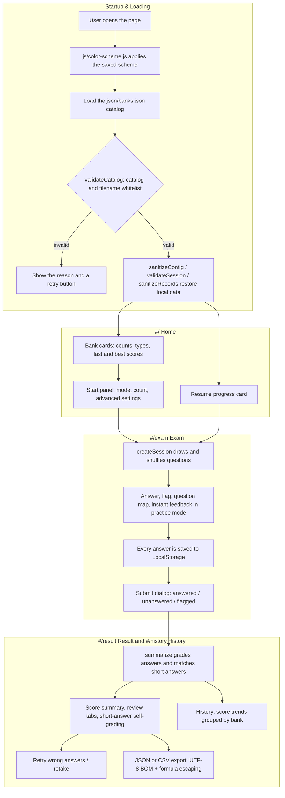
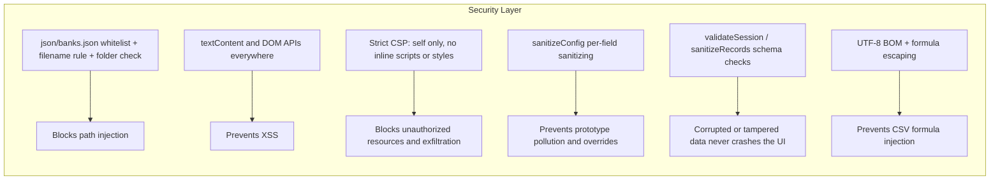

# Examination System

[繁體中文版](README.md)

> A client-side practice and mock exam platform with zero runtime dependencies: start from a bank card in one click, choose between exam and practice modes, retry wrong answers, self-grade short answers, keep progress automatically, track score trends, switch between light and dark themes, and export results defensively.

[](CHANGELOG.en.md)
[](LICENSE)
[](https://developer.mozilla.org/en-US/)
[](package.json)
[](docs/adr/ADR-002-frontend-architecture.en.md)
[](https://scorpio-meow.github.io/Examination-System/)
[](https://github.com/Scorpio-meow/Examination-System/issues)
[](https://github.com/Scorpio-meow/Examination-System/pulls)

---

## Table of Contents

- [Quick Start](#quick-start)
- [Live Demo](#live-demo)
- [Architecture & Data Flow](#architecture--data-flow)
- [Features](#features)
- [Available Question Banks](#available-question-banks)
- [Configuration Settings](#configuration-settings)
- [Keyboard Shortcuts](#keyboard-shortcuts)
- [Data Schema & Standards](#data-schema--standards)
- [File Structure](#file-structure)
- [Security & Defensive Architecture](#security--defensive-architecture)
- [Visual Previews](#visual-previews)
- [Development & Testing](#development--testing)
- [Troubleshooting](#troubleshooting)
- [FAQ](#faq)
- [Changelog](#changelog)
- [Contribution Guide](#contribution-guide)
- [Contact](#contact)
- [License](#license)

---

## Quick Start

### Online Execution (Recommended)

Open [https://scorpio-meow.github.io/Examination-System/](https://scorpio-meow.github.io/Examination-System/) directly; nothing needs to be installed.

### Local Execution

1. Clone or download the repository:
   ```bash
   git clone https://github.com/Scorpio-meow/Examination-System.git
   cd Examination-System
   ```

2. Start a local static file server (required: browsers do not load ES modules or the question bank JSON over `file://`):

   - **Using Bun (Recommended)**:
     ```bash
     bun x http-server -p 8000
     ```

   - **Using Python 3**:
     ```bash
     python3 -m http.server 8000
     ```

   - **Using Windows PowerShell**:
     ```powershell
     py -3 -m http.server 8000
     ```

3. Open [http://localhost:8000](http://localhost:8000) in your browser.

4. Pick a bank card on the home page, choose exam or practice mode and a question count, then press the start button (for example 「開始 20 題模擬考」, "Start a 20-question exam").

> **Important Notice**: Do not open `index.html` by double-clicking it in your file explorer. Browser cross-origin rules block the modules and question banks from loading.

---

## Live Demo

The application is deployed on GitHub Pages over HTTPS, with a responsive layout for desktops, tablets and phones:

**[https://scorpio-meow.github.io/Examination-System/](https://scorpio-meow.github.io/Examination-System/)**

Use the `?bank=` parameter to preselect a bank, for example [`?bank=IPAS-AI-L12-A.json`](https://scorpio-meow.github.io/Examination-System/?bank=IPAS-AI-L12-A.json).

---

## Architecture & Data Flow

The system is a serverless client-side application. ES modules separate the responsibilities, and hash routes switch between four views: home, exam, result and history. See [ADR-002: Front-end Rewrite](docs/adr/ADR-002-frontend-architecture.en.md) for the full design decisions.


```mermaid
flowchart TD
    subgraph Boot [Startup & Loading]
        A[User opens the page] --> B[js/color-scheme.js applies the saved scheme]
        B --> C[Load the json/banks.json catalog]
        C --> D{validateCatalog: catalog and filename whitelist}
        D -- invalid --> E[Show the reason and a retry button]
        D -- valid --> F[sanitizeConfig / validateSession / sanitizeRecords restore local data]
    end

    subgraph Home ["#/ Home"]
        F --> G[Bank cards: counts, types, last and best scores]
        G --> H[Start panel: mode, count, advanced settings]
        F --> I[Resume progress card]
    end

    subgraph Exam ["#/exam Exam"]
        H --> J[createSession draws and shuffles questions]
        I --> J
        J --> K[Answer, flag, question map, instant feedback in practice mode]
        K --> L[Every answer is saved to LocalStorage]
        L --> M[Submit dialog: answered / unanswered / flagged]
    end

    subgraph Result ["#/result Result and #/history History"]
        M --> N[summarize grades answers and matches short answers]
        N --> O[Score summary, review tabs, short-answer self-grading]
        O --> P[Retry wrong answers / retake]
        O --> Q[JSON or CSV export: UTF-8 BOM + formula escaping]
        N --> R[History: score trends grouped by bank]
    end
```

---

## Features

### Examination & Interaction

| Feature | Description |
|---------|-------------|
| Bank Cards | 11 banks grouped into ERP, iPAS AI and Management & Finance; each card shows a short name, question count, question types, whether explanations are included, and the last and best scores |
| Two Modes | "Exam" reveals answers after submission; "Practice" shows right or wrong and the explanation immediately after each answer and then locks it |
| Flexible Drawing | 10 / 20 / 50 / all / custom question counts; choices larger than the bank are hidden, and the start button states the count (「開始 20 題模擬考」) |
| Shuffled Questions & Options | Questions and options can be shuffled; the correct answer is re-mapped after shuffling options |
| Flags & Question Map | Press <kbd>F</kbd> to flag a question; the question map shows current, answered, flagged and unanswered questions and can filter to unanswered or flagged ones |
| Submission Dialog | The 「交卷」 (Submit) button stays in the top bar; the dialog lists answered, unanswered and flagged counts and can jump to the first unanswered question |
| Timer | Counts only the time spent on the exam page; the time between leaving and resuming is excluded, and the timer can be hidden |
| Mobile | A fixed bottom bar (previous, question list, next), a bottom sheet for the question map, and touch targets of at least 44px |

### Results & Retry

| Feature | Description |
|---------|-------------|
| Score Summary | The score ring changes color with the pass state and marks the passing line; it shows correct, wrong and unanswered counts, the time spent and the change from the previous attempt |
| Answer Review | Tabs for wrong, unanswered, pending self-grade, flagged and all questions; wrong answers are expanded by default, everything can be expanded or collapsed, and 50 questions are shown per page |
| Retry Wrong Answers | One click redoes the wrong answers of this attempt in practice mode |
| Short-Answer Self-Grading | A lenient match (ignoring full-width forms, spaces, letter case and trailing punctuation) runs first; answers that do not match are graded by the user with 「我答對了」 / 「我答錯了」 ("I got it right" / "I got it wrong"), and the score updates immediately |
| History | Keeps the latest 100 attempts and shows the latest score, best score and a score trend chart for each bank |

### Persistence & Interface

| Feature | Description |
|---------|-------------|
| Auto-save | Every answer is written to LocalStorage; both "Leave" and the browser Back button save progress before returning home |
| Resume Progress | The top of the home page shows unfinished progress (bank, answered count, start time) with continue and discard-and-restart actions |
| Data Lifetime (TTL) | Progress, the last result, settings and history are kept for 7 days after their last update and then removed |
| Light & Dark Themes | Follows the system by default with a toggle in the top bar; every color is a token checked against WCAG AA contrast |
| Data & Privacy | The 「資料與隱私」 (Data & Privacy) footer link explains retention and can clear all local data after confirmation |
| Legacy Migration | v3 progress, settings and history are converted automatically on upgrade |

### Exported Fields

The exported column names are in Traditional Chinese; the English meaning is shown in parentheses.

| Export Field | Description | Example Format |
|--------------|-------------|----------------|
| 編號 (Index) | Question order in this attempt | `1` |
| ID | Original question bank identifier | `101` |
| 類型 (Type) | Question type | `單選題` (single choice) / `簡答題` (short answer) |
| 題目 (Question) | Question statement | `專案的三大限制為何？` |
| 選項 (Options) | Options block | `A. 範疇\nB. 時程\nC. 成本\nD. 品質` |
| 作答 (User Answer) | Answer given by the user | `A` |
| 解答 (Correct Answer) | Standard answer | `A` |
| 是否正確 (Is Correct) | Grading result | `是` (yes) / `否` (no) / `待自評` (pending self-grade) |
| 解釋 (Explanation) | Explanation | `傳統專案管理三角形限制為範疇、時程與成本。` |
| 題庫標籤 (Bank Label) | Bank name | `專案管理` |
| 匯出時間 (Export Time) | Export timestamp | `2026-10-09T10:15:30.000Z` |

- **CSV Formula Injection Mitigation**: CSV files use `UTF-8 with BOM` so Microsoft Excel detects Chinese text, and cells beginning with `=`, `+`, `-` or `@` get a leading single quote to block formula injection.
- **Safe Download Dispatch**: Blob downloads are triggered with `dispatchEvent(new MouseEvent(...))` without attaching a temporary `<a>` element to the document; the file name includes the bank file name, for example `exam_result_ipas-ai-l12-a_20261009_221530.csv`.

---

## Available Question Banks

The repository ships 11 banks in the `./json/` directory. [`json/banks.json`](json/banks.json) manages their groups, names and question statistics:

| Bank Name | File Path | Questions | Focus Area & Description |
|-----------|-----------|-----------|--------------------------|
| ERP Planner Reference Questions | `json/ERP Planner_Reference Question Types_202509_V06.json` | 443 | ERP framework, production, distribution, accounting and implementation (with full Traditional Chinese explanations) |
| ERP Basic Certification (Academic) | `json/PFERP_Reference119_20240201.json` | 119 | Business process integration, production control, sales and inventory, accounting and ERP certification fundamentals |
| iPAS AI Application Planner L11 (A) | `json/IPAS-AI-L11-A.json` | 45 | AI fundamentals, machine learning concepts, algorithm evaluation and AI governance |
| iPAS AI Application Planner L11 (B) | `json/IPAS-AI-L11-B.json` | 45 | Ethics and privacy, data governance, the ML project lifecycle and model validation |
| iPAS AI Application Planner L1101 #130994 | `json/IPAS-AI-L11-130994.json` | 50 | Official 2025 (ROC year 114) iPAS AI Application Planner entry-level subject 1 questions |
| iPAS AI Application Planner L12 (A) | `json/IPAS-AI-L12-A.json` | 35 | Generative AI prompt engineering, LLM parameters and RAG architecture |
| iPAS AI Application Planner L12 (B) | `json/IPAS-AI-L12-B.json` | 35 | Retrieval augmentation, fine-tuning and vector databases |
| iPAS AI Application Planner L12 (C) | `json/IPAS-AI-L12-C.json` | 35 | AI agent workflows, evaluation metrics and output consistency control |
| iPAS AI Application Planner L12 (D) | `json/IPAS-AI-L12-D.json` | 35 | Enterprise generative AI architecture, security validation, cost optimization and operations |
| Project Management | `json/Project_Management.json` | 50 | PMI PMBOK 12 principles, 8 performance domains and agile delivery |
| Financial Planning | `json/Basic_Financial_Planning.json` | 151 | Household budgeting, investment strategy, taxation, insurance and retirement (138 single choice, 13 short answer) |

Every bank except ERP Basic Certification and Financial Planning includes an explanation for each question.

---

## Configuration Settings

The options in the home page start panel and its advanced settings are remembered automatically (stored in `examConfig`):

| Setting Key | Type | Default | Valid Options / Range | Description |
|-------------|------|---------|-----------------------|-------------|
| `bank` | String | `defaultBank` in `json/banks.json` | A file name in the bank catalog | The selected bank; the `?bank=` URL parameter takes priority |
| `mode` | String | `exam` | `exam` / `practice` | Exam or practice mode |
| `count` | String / Number | `all` | `10` / `20` / `50` / `all` / `custom` | Number of questions to draw |
| `customCount` | Number | `20` | `1` ~ bank size | Question count when "custom" is selected |
| `shuffleQuestions` | Boolean | `false` | `true` / `false` | Shuffle the question order |
| `shuffleOptions` | Boolean | `false` | `true` / `false` | Shuffle single-choice options |
| `passingScore` | Number | `60` | `0` ~ `100` | Passing score (stored with each attempt when it starts) |
| `showExplanation` | Boolean | `true` | `true` / `false` | Show explanations after answering in practice mode and in the result review |
| `showTimer` | Boolean | `true` | `true` / `false` | Show the timer on the exam page (can also be toggled during an exam) |
| `shortcuts` | Boolean | `true` | `true` / `false` | Enable single-key shortcuts (number keys, F, ?) |

The color scheme preference is stored separately in `color-scheme` and is written only after a manual toggle.

---

## Keyboard Shortcuts

| Key Binding | Context | Action |
|-------------|---------|--------|
| <kbd>1</kbd> / <kbd>2</kbd> / <kbd>3</kbd> / <kbd>4</kbd> | Single choice | Select option A / B / C / D |
| <kbd>←</kbd> / <kbd>→</kbd> | Exam page | Previous / next question |
| <kbd>Enter</kbd> | Exam page | Goes to the next question when focus is not on a button or link; activates the focused button otherwise. Never submits the exam |
| <kbd>F</kbd> | Exam page | Flag or unflag the current question |
| <kbd>?</kbd> | Exam page | Open the shortcut guide |
| <kbd>Esc</kbd> | Dialogs | Close the dialog or the question sheet |

Shortcuts are ignored while typing in a short-answer box, and combinations with <kbd>Alt</kbd> / <kbd>Ctrl</kbd> / <kbd>⌘</kbd> are left to the browser. Number keys, <kbd>F</kbd> and <kbd>?</kbd> can be turned off in the advanced settings.

---

## Data Schema & Standards

### Question Bank JSON Schema

#### Single Choice Question Format

```json
[
  {
    "id": 1,
    "question": "What are the triple constraints in traditional project management?",
    "options": [
      "A. Scope, Schedule, Cost",
      "B. Quality, Communication, Risk",
      "C. Resources, Equipment, Capital",
      "D. Objectives, Plans, Execution"
    ],
    "answer": "A",
    "explanation": "The traditional project management triangle constraints are Scope, Schedule (Time), and Cost."
  }
]
```

#### Short Answer Question (SAQ) Format

```json
[
  {
    "id": 2,
    "type": "SAQ",
    "question": "Explain the core operational concept of Retrieval-Augmented Generation (RAG).",
    "answer": "RAG combines external document retrieval with LLMs to provide contextually accurate responses while mitigating hallucinations.",
    "explanation": "RAG retrieves relevant document chunks from a vector database and injects them as context into the prompt before LLM generation."
  }
]
```

- Option prefixes (`A.`, `B．`, `C、` and similar) are removed only when the letter matches the option's position.
- Questions without a statement, with an answer outside the options, or with an unsupported type are skipped and the reasons are listed in the browser console; the system never generates placeholder content.

### Bank Catalog `json/banks.json`

```json
{
  "defaultBank": "ERP Planner_Reference Question Types_202509_V06.json",
  "groups": [{ "id": "ipas", "title": "iPAS AI 應用規劃師" }],
  "banks": [
    {
      "file": "IPAS-AI-L12-A.json",
      "group": "ipas",
      "title": "IPAS AI應用規劃師【L12 生成式 AI 應用與規劃】模擬考(A卷)",
      "shortTitle": "L12 · A 卷",
      "subtitle": "生成式 AI 應用與規劃",
      "questionCount": 35,
      "typeCounts": { "single": 35, "saq": 0 },
      "explanationCount": 35
    }
  ]
}
```

`questionCount`, `typeCounts` and `explanationCount` are generated from the bank contents by `bun run build:banks`; the other fields are maintained by hand.

---

## File Structure

```
Examination-System/
├── index.html                  # Page skeleton: top bar, four views, dialogs and SVG icons
├── app.js                      # Entry point: startup, hash routing and cross-view flows
├── style.css                   # Stylesheet (@layer cascade, light / dark tokens)
├── js/
│   ├── color-scheme.js         # Prevents a color scheme flash (synchronous classic script)
│   ├── catalog.js              # Catalog validation and filename whitelist
│   ├── bank.js                 # Bank download and normalization
│   ├── session.js              # Drawing, answering, flags, grading, short-answer matching
│   ├── storage.js              # LocalStorage TTL, schema validation, v3 migration
│   ├── history.js              # History aggregation and per-bank statistics
│   ├── export.js               # JSON / CSV export
│   ├── router.js               # Hash routing
│   ├── ui.js                   # Dialogs, toasts and menus
│   ├── theme.js                # Light / dark toggle
│   ├── dom.js                  # Safe DOM building and formatting helpers
│   └── views/                  # home.js, exam.js, result.js, history.js
├── json/
│   ├── banks.json              # Bank catalog (whitelist and statistics)
│   └── *.json                  # 11 question banks
├── assets/logo-64.png          # Top bar logo
├── favicon.png                 # Source icon artwork (2048×2048, not referenced by the page)
├── favicon-32.png              # Browser tab icon (32×32)
├── favicon-512.png             # High-resolution site icon (512×512)
├── apple-touch-icon.png        # iOS home screen icon (180×180, opaque background)
├── scripts/build-banks.js      # Generates / checks catalog statistics
├── tests/                      # bun test unit tests
├── package.json                # Development scripts (no dependencies)
├── CHANGELOG.md / CHANGELOG.en.md
├── README.md / README.en.md
├── llms.txt                    # Project index for LLMs and AI tools
├── LICENSE                     # MIT License
└── docs/
    ├── screenshots/            # Interface screenshots (WebP)
    └── adr/                    # Architecture Decision Records ADR-001, ADR-002 (Chinese & English)
```

---

## Security & Defensive Architecture

See [ADR-001: Client-Side Data Security and Defensive Verification Mechanism](docs/adr/ADR-001-local-security-validation.en.md) and [ADR-002: Front-end Rewrite](docs/adr/ADR-002-frontend-architecture.en.md) for the full analysis.


```mermaid
graph LR
    subgraph Defenses [Security Layer]
        D1[json/banks.json whitelist + filename rule + folder check] --> S1[Blocks path injection]
        D2[textContent and DOM APIs everywhere] --> S2[Prevents XSS]
        D3[Strict CSP: self only, no inline scripts or styles] --> S3[Blocks unauthorized resources and exfiltration]
        D4[sanitizeConfig per-field sanitizing] --> S4[Prevents prototype pollution and overrides]
        D5[validateSession / sanitizeRecords schema checks] --> S5[Corrupted or tampered data never crashes the UI]
        D6[UTF-8 BOM + formula escaping] --> S6[Prevents CSV formula injection]
    end
```

### Architectural Scope Disclaimer

> **This project is designed as a client-side practice and self-study tool**:
> 1. All question banks and answers are public JSON files in the browser.
> 2. All grading runs in browser JavaScript with no server-side verification.
> 3. This system is **not suitable** for official certification, competitive or proctored exams.

---

## Visual Previews

The interface is in Traditional Chinese.

### Home: Bank Cards and Start Panel


### Exam: Question Card and Question Map


### Practice Mode and Dark Theme


### Result and History


### Mobile

<p>
  
  
</p>

---

## Development & Testing

Development tooling uses [Bun](https://bun.sh/); the site itself needs no build step.

```bash
bun test
```

```bash
bun run build:banks
```

```bash
bun run check:banks
```

- `bun test`: runs the unit tests in `tests/` (bank normalization, catalog whitelist, storage validation and legacy migration, drawing and grading, history, CSV protection).
- `bun run build:banks`: recalculates the statistics in `json/banks.json` from the `json/` contents and lists bank files that are not in the catalog yet.
- `bun run check:banks`: only checks whether the statistics are stale and exits with a non-zero status if they are; run it before committing.

---

## Troubleshooting

| Issue | Potential Cause | Recommended Solution |
|-------|-----------------|----------------------|
| Stuck on 「正在載入題庫目錄」 ("Loading the bank catalog") or shows 「無法載入題庫目錄」 ("Cannot load the bank catalog") | Opened via `file://`, or the server does not serve `json/banks.json` | Start a local server as described in [Quick Start](#quick-start); the retry button reloads the catalog |
| The start panel shows 「題庫載入失敗」 ("Failed to load the bank") | Network problem or a missing bank file | Check the connection and press retry; when adding a bank, make sure its file name is in `json/banks.json` |
| The console reports `json/banks.json 的統計與 … 實際內容不符` (catalog statistics do not match the bank) | The bank changed but the catalog statistics were not regenerated | Run `bun run build:banks` |
| CSV export shows garbled text in Excel | Older Excel versions do not detect UTF-8 automatically | Use Excel "Data > From Text/CSV" and choose "65001 : Unicode (UTF-8)" |
| Shortcuts do not respond | Typing in a text box, a dialog is open, or single-key shortcuts are turned off | Click the question area and try again, or turn them on in the home page advanced settings |
| Progress or history is gone | Private browsing, or more than 7 days since the last update | The app relies on LocalStorage; use a normal window for long-term practice |
| Need to clear everything and start over | Old settings or records get in the way | Open 「資料與隱私」 (Data & Privacy) in the footer and choose 「清除所有本機資料」 (Clear all local data) |

---

## FAQ

**Q: What is the difference between exam and practice mode?**
A: Exam mode shows right or wrong and the explanations only after submission, and answers can be changed until then. Practice mode shows the result and explanation right after each answer and locks it, which suits question-by-question study.

**Q: How are short answers scored?**
A: The system first runs a lenient match that ignores full-width versus half-width forms, spaces, letter case and trailing punctuation. Matching answers count as correct; the rest are marked as pending self-grade, and the result page shows your answer next to the reference answer so you can choose 「我答對了」 / 「我答錯了」. The score and history update immediately.

**Q: Will shuffling options cause scoring errors?**
A: No. Shuffling re-maps the correct answer letter by option content, and the unit tests cover this case.

**Q: Can I use this on phones or tablets?**
A: Yes. The mobile layout has a fixed bottom bar and a question sheet with touch targets of at least 44px; the layout was accepted on a 375px-wide phone viewport.

**Q: How do I add a new question bank?**
A: Follow three steps:
1. Put the bank JSON into `./json/` following the [Data Schema](#data-schema--standards).
2. Add an entry to `banks` in `json/banks.json` (`file`, `group`, `title`, `shortTitle`, optional `subtitle`).
3. Run `bun run build:banks` to generate the statistics, then reload the page to see the new bank card.

---

## Changelog

Detailed release notes are tracked in [CHANGELOG.en.md](CHANGELOG.en.md).

- **Current Version**: `v4.0.0` (2026-10-09)
  - New interface and design system: bank cards, start panel, light and dark themes
  - Practice mode, wrong-answer retry, flags, question map, submission dialog and a mobile bottom bar
  - Result review tabs, short-answer self-grading and history trend charts
  - ES modules, hash routing, the `json/banks.json` bank catalog and unit tests
- **Milestone Releases**:
  - `v3.5.2`: Completed explanations for ERP Planner reference questions and unified bank paths under `json/`
  - `v3.5.1`: Introduced bank whitelisting, defensive schema verification, CSP hardening, and safe file dispatching
  - `v3.5.0`: Added random question extraction, multi-bank ERP additions, and UI aesthetic refactoring
  - `v3.4.1`: Introduced conditional logging and explicit client-side scope boundaries
  - `v3.3.2`: Added iPAS AI banks, question grid sidebar, CSV/JSON exports, and LocalStorage TTL

---

## Contribution Guide

We welcome contributions to question banks, architecture and features:

1. Fork this repository to your GitHub account.
2. Create a feature branch: `git checkout -b feature/your-feature-name`.
3. Run `bun test` and `bun run check:banks` after your changes.
4. Commit using Conventional Commits: `git commit -m 'feat: add new question bank'`.
5. Push to your branch: `git push origin feature/your-feature-name`.
6. Open a Pull Request describing your changes and test results.

---

## Contact

| Channel | Badge / Link |
|---------|--------------|
| **Email** | [](mailto:yao921024@gmail.com) |
| **Instagram** | [](https://www.instagram.com/scorpio_meow_1024) |
| **Threads** | [](https://www.threads.com/@scorpio_meow_1024) |
| **Issue Tracker** | [](https://github.com/Scorpio-meow/Examination-System/issues) |
| **Pull Requests** | [](https://github.com/Scorpio-meow/Examination-System/pulls) |
| **Repository** | [](https://github.com/Scorpio-meow/Examination-System) |

---

## License

This project is licensed under the [MIT License](LICENSE).