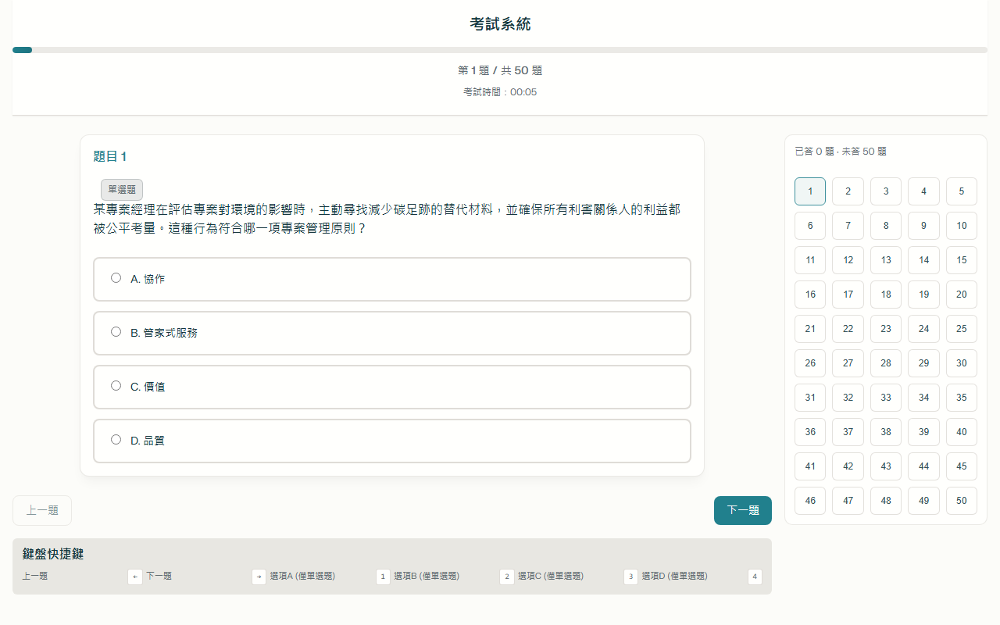
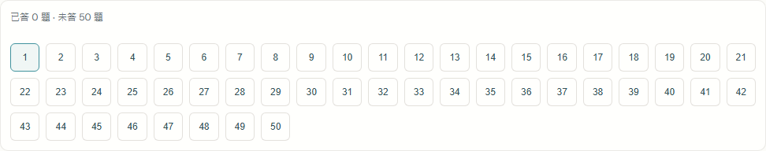

# 考試系統 📚

一個基於 Web 的知識測驗系統，提供多種題庫（專案管理、理財規劃，以及 IPAS模擬題），包含單選題與簡答題，涵蓋核心知識與實務應用。適合大學生、專業人士或任何希望評估其專業知識的使用者。


## 功能特色

### 🎯 考試功能
- **多種專業題庫**：
  - **專案管理**：涵蓋專案管理12項原則、8大績效領域等核心知識
  - **理財規劃**：涵蓋基本理財知識與規劃策略
  - **IPAS 題庫**：
    - L11 基礎與治理（IPAS-AI-L11-A.json、IPAS-AI-L11-B.json）
    - L12 生成式 AI 應用與規劃（IPAS-AI-L12-A.json、IPAS-AI-L12-B.json、IPAS-AI-L12-C.json、IPAS-AI-L12-D.json）
- **多樣題型**：
  - **單選題**：每題提供4個選項，選擇最適合的答案
  - **簡答題**：需要提供簡短文字回答
- **詳細解釋**：每題附有詳細解釋，幫助理解概念
- **無時間限制**：讓您充分思考每個問題
- **及格分數60分**：標準化評分機制
- **答題記錄**：記錄您的答題選擇，方便查看結果
- **題號導覽與快速跳題**：右側顯示題號按鈕陣列，可點擊任意題號直接跳轉

### ⚙️ 個人化設置
- **題目隨機打亂**：每次考試順序不同，增加挑戰性
- **選項隨機排列**：避免記憶位置影響學習效果（自動重新標註 A–D，並同步更新正確答案以確保判分正確）
- **自動保存進度**：意外關閉瀏覽器也不怕遺失進度
- **答案解釋顯示**：幫助理解錯誤原因
- **題庫切換**：可隨時在專案管理、理財規劃與 IPAS 題庫（L11 A/B、L12 A–D）之間切換
- **深色/淺色主題**：自動適應系統偏好設定

### 🎨 使用者體驗
- **響應式設計**：支援桌機、平板、手機等各種裝置
- **深色/淺色主題**：自動適應系統偏好設定
- **鍵盤快捷鍵**：提升操作效率
- **無障礙設計**：考慮各種使用者需求
- **直覺式介面**：清晰易用的使用者界面
- **即時反饋**：選擇選項時提供視覺反饋
- **右側側邊欄導覽**：題號按鈕陣列 + 已答/未答統計，狀態即時同步

### 📊 結果分析
- **詳細成績報告**：顯示總分、正確率和考試結果
- **錯題分析**：針對答錯題目提供解釋
- **歷史記錄**：查看之前的考試記錄

## 安裝與使用

### 快速預覽

> 下圖為考試頁主畫面與右側題號側邊欄示意。





### 快速開始
1. 下載專案檔案到本地
2. 使用網頁伺服器開啟 `index.html`
   ```bash
   # 使用 Python 內建的 HTTP 伺服器
   python -m http.server
   
   # 或使用 PowerShell (Windows)
   python -m http.server
   # 然後在瀏覽器中訪問: http://localhost:8000
   ```
3. 或直接在瀏覽器中開啟（推薦使用現代瀏覽器如 Chrome、Edge、Comet）
4. 在首頁的「選擇題庫」下拉選單選擇：
  - 專案管理 / 理財規劃
  - IPAS L11：IPAS-AI-L11-A / IPAS-AI-L11-B
  - IPAS L12：IPAS-AI-L12-A / B / C / D
  之後按「開始考試」。

### 檔案結構
```
├── index.html              # 主頁面
├── app.js                  # 應用程式邏輯
├── style.css               # 樣式表
├── Project_Management.json # 專案管理題庫
├── Basic_Financial_Planning.json # 理財規劃題庫
├── IPAS-AI-L11-A.json     # IPAS L11 題庫 A（AI 基礎與治理）
├── IPAS-AI-L11-B.json     # IPAS L11 題庫 B（AI 基礎與治理）
├── IPAS-AI-L12-A.json     # IPAS L12 題庫 A（生成式 AI 應用與規劃）
├── IPAS-AI-L12-B.json     # IPAS L12 題庫 B（生成式 AI 應用與規劃）
├── IPAS-AI-L12-C.json     # IPAS L12 題庫 C（生成式 AI 應用與規劃）
├── IPAS-AI-L12-D.json     # IPAS L12 題庫 D（生成式 AI 應用與規劃）
├── LICENSE.txt             # MIT授權條款
└── README.md               # 專案說明
```

## 技術架構

### 技術特點
- **純JavaScript開發**：無需任何框架或外部依賴
- **本地存儲功能**：使用LocalStorage保存進度和設定
- **JSON格式題庫**：易於維護和擴展
- **CSS變數應用**：輕鬆支援深色/淺色主題切換
- **語義化HTML結構**：提升可訪問性和SEO表現
- **離線可用**：所有資源都在本地，無需網絡連接

### 系統需求
- **瀏覽器**：Chrome 70+、Firefox 65+、Safari 12+、Edge 79+、Opera 60+
- **JavaScript**：需要啟用
- **本地存儲**：用於保存進度和設定（確保未開啟無痕/隱私模式）

## 題庫內容

### 專案管理題庫
包含多樣題型，主要涵蓋以下內容：
#### 專案管理12項原則 (題目1-10)
- 管家式服務：負責任地使用資源，公平考量利害關係人利益
- 協作：促進團隊合作、資訊分享和共同解決問題
- 價值：強調創造實質的業務效益和長期價值
- 系統思考：考慮專案內外部因素的相互作用
- 領導力：激勵團隊、提升士氣和協助解決問題
- 品質：確保產品滿足甚至超越客戶期望
- 複雜性：分解、迭代解決相依與不確定的問題
- 風險：識別和應對潛在威脅和機會
- 適應性與韌性：面對重大變更的靈活調整能力
- 變革管理：協助組織和人員順利過渡並接受變化

#### 8大績效領域 (題目11-18)
- 利害關係人績效領域：識別和管理所有相關人員
- 團隊績效領域：提升團隊溝通和合作效率
- 開發方法與生命週期：選擇最適合的開發模式
- 規劃績效領域：詳細定義專案執行策略
- 專案工作績效領域：執行實際工作和管理日常障礙
- 交付績效領域：確保專案交付物的品質和完成度
- 衡量績效領域：資料收集與績效評估
- 不確定性績效領域：討論風險與應對策略

#### 專案管理基本概念
涵蓋專案定義、專案集合、生命週期、敏捷方法、管理過程等核心知識點

### 理財規劃題庫
包含基本財務規劃、投資策略、風險管理、退休規劃等重要理財知識，依章節分類，涵蓋：
- 基本財務觀念與計算
- 投資工具與策略
- 風險評估與管理
- 退休規劃與資產配置
- 保險與稅務規劃

### IPAS 題庫（L11、L12）
聚焦於企業實務數位化與 AI 應用情境，包括但不限於：
- No Code / Low Code 選型、擴充、效能與成本考量
- 生成式 AI 在內容、生產力與多媒體應用（提示策略、seed 控制、一致性）
- RAG、微調、合規/隱私與治理框架
- 敏捷與產品交付實務、風險控管與實驗設計

各題庫為獨立 JSON 檔（`IPAS-AI-L11-*.json`、`IPAS-AI-L12-*.json`），可直接於介面中切換使用。

## 開發指南

### 擴展題庫
如需添加新題庫或修改現有題庫，請遵循以下 JSON 格式：

```json
[
  {
    "id": 1,
    "question": "題目內容",
    "options": [
      "A. 選項A",
      "B. 選項B",
      "C. 選項C",
      "D. 選項D"
    ],
    "answer": "B",
    "explanation": "答案解釋"
  },
  {
    "id": 2,
    "question": "簡答題內容",
    "type": "SAQ",
    "answer": "標準答案",
    "explanation": "答案解釋"
  }
]
```

### 切換題庫與新增選項
- 介面中的下拉選單（`question-bank-select`）會列出可用題庫。
- 若新增新的 JSON 題庫檔，請在 `index.html` 的 `question-bank-select` 內加入對應 `<option>`，檔名會由 `app.js` 直接載入（使用相對路徑 fetch）。
- 檔名建議使用易辨識規則（例如：`<Domain>_<Topic>.json` 或 `ipass-<Letter>.json`）。

## 使用指南

### 鍵盤快捷鍵

- **← →**：上一題/下一題導航
- **1-4**：快速選擇選項A-D（僅適用於單選題）
- **Enter**：提交當前選擇或進入下一題

### 題號按鈕導覽

- 右側題號按鈕陣列可直接點擊跳到指定題目
- 已答題以綠色描邊標示，未答題透明度較低；當前題會高亮顯示

### 自訂設定

在考試開始前，您可以調整以下設定：
- **選擇題庫**：選擇「專案管理」或「理財規劃」題庫
- **隨機打亂題目順序**：是否隨機排列考題（預設關閉）
- **隨機打亂選項順序**：是否隨機排列選項（預設關閉）
- **自動保存進度**：是否自動保存答題進度（預設開啟）
- **顯示答案解釋**：結果頁面是否顯示詳細解釋（預設開啟）
- **及格分數設定**：自訂及格標準（預設60分）

## 授權條款

本專案採用 MIT 授權條款，允許自由使用、修改和分發。詳見 [LICENSE.txt](LICENSE.txt) 檔案。

## 常見問題解答 (FAQ)

### Q: 如何在手機上使用此考試系統？
A: 只需在手機瀏覽器中開啟 (https://scorpio-meow.github.io/Examination-System/) 。系統採用響應式設計，會自動適應您的手機螢幕大小。

### Q: 如何添加新的題庫？
A: 參考 `Project_Management.json` 的格式，創建一個新的 JSON 檔，並在 `index.html` 的 `question-bank-select` 下拉選單中加入新選項；同時確保 `app.js` 能載入該檔案（例如加到題庫映射）。

### Q: 考試系統是否會記錄我的考試歷史？
A: 是的，系統會使用瀏覽器的 LocalStorage 功能記錄您的考試歷史。但請注意，如果您清除瀏覽器數據或使用隱私瀏覽模式，歷史記錄將會丟失。

### Q: 能否匯出我的考試結果？
A: 目前版本暫不支持結果匯出功能，但您可以使用截圖來保存結果頁面。

### Q: 考試時間有限制嗎？
A: 預設情況下沒有時間限制，您可以按照自己的節奏完成測驗。

## 版本記錄（Changelog）

### 3.1.0 — 2025-08-08
- 新增：右側側邊欄題號陣列（可點擊跳題）與「已答/未答」即時統計
- 新增：選項隨機排列支援自動重新標註 A–D，並同步更新正確答案，確保判分與回顧顯示正確
- 變更：移除「題目很短時自動附加部分解釋」的顯示邏輯，避免干擾作答
- 介面：考試頁改為主內容 + 右側側邊欄布局，並優化響應式

### 3.0.0 — 2025-08-08
- 新增 IPAS 系列題庫（A、B、C、D）
- README 增補檔案結構、題庫說明與切換/擴充指引
- 輕微文案調整與排版優化

### 2.0.0 — 2025-06-26
- 新增理財規劃題庫與 SAQ 簡答題型
- 強化結果分析與歷史記錄

---

**考試系統** - 2025年6月更新 - 助您掌握專業知識，提升考試能力！