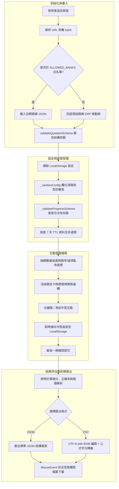
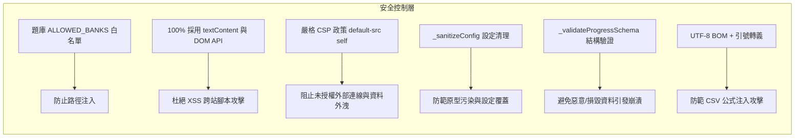

# 考試系統 (Examination System)

[English Version](README.en.md)

> 基於純前端技術打造的專業知識測驗與模擬考試平台，支援題庫隔離載入、彈性隨機抽題、進度自動保存、答題狀態分析與防禦性資料匯出。

[](CHANGELOG.md)
[](LICENSE)
[](https://developer.mozilla.org/zh-TW/)
[-success?style=flat-square)](app.js)
[](style.css)
[](https://scorpio-meow.github.io/Examination-System/)
[](https://github.com/Scorpio-meow/Examination-System/issues)
[](https://github.com/Scorpio-meow/Examination-System/pulls)

---

## 目錄

- [快速開始](#快速開始)
- [線上試用](#線上試用)
- [系統架構與運作流程](#系統架構與運作流程)
- [功能特色](#功能特色)
- [題庫規格與資料統計](#題庫規格與資料統計)
- [設定選項規格](#設定選項規格)
- [鍵盤快捷鍵](#鍵盤快捷鍵)
- [資料結構規範](#資料結構規範)
- [檔案目錄結構](#檔案目錄結構)
- [安全防禦與架構限制](#安全防禦與架構限制)
- [介面預覽](#介面預覽)
- [疑難排解](#疑難排解)
- [常見問題](#常見問題)
- [版本記錄](#版本記錄)
- [貢獻指南](#貢獻指南)
- [聯絡方式](#聯絡方式)
- [授權條款](#授權條款)

---

## 快速開始

### 線上使用（推薦）

直接造訪 [https://scorpio-meow.github.io/Examination-System/](https://scorpio-meow.github.io/Examination-System/)，無需安裝任何伺服器或依賴套件。

### 本機執行

1. 複製或下載專案原始碼：
   ```bash
   git clone https://github.com/Scorpio-meow/Examination-System.git
   cd Examination-System
   ```

2. 啟動本機靜態網頁伺服器（必要步驟：避免瀏覽器安全性原則阻擋 `file://` 協定下的 JSON 異步請求）：

   - **使用 Bun（推薦）**：
     ```bash
     bun x http-server -p 8000
     ```

   - **使用 Python 3**：
     ```bash
     python3 -m http.server 8000
     ```

   - **使用 Windows PowerShell**：
     ```powershell
     py -3 -m http.server 8000
     ```

3. 開啟瀏覽器造訪 [http://localhost:8000](http://localhost:8000)。

4. 在首頁「選擇題庫」下拉選單中挑選目標題庫，設定抽題條件後點擊「開始考試」。

> **重要提示**：請勿直接透過檔案總管雙擊 `index.html` 開啟，瀏覽器跨來源資源共享 (CORS) 安全性限制會導致題庫 JSON 讀取失敗。

---

## 線上試用

本系統已自動部署於 GitHub Pages，支援 HTTPS 加密傳輸與全終端響應式介面：

**[https://scorpio-meow.github.io/Examination-System/](https://scorpio-meow.github.io/Examination-System/)**

---

## 系統架構與運作流程

本系統採純前端無伺服器（Serverless Client-Side）架構，核心生命週期涵蓋題庫載入驗證、狀態恢復、考試互動循環與防禦性資料匯出：


```mermaid
flowchart TD
    subgraph ClientInit [初始化與載入]
        A[使用者造訪頁面] --> B[解析 URL 參數 bank]
        B --> C{是否於 ALLOWED_BANKS 白名單?}
        C -- 是 --> D[載入目標題庫 JSON]
        C -- 否 --> E[回退預設題庫 ERP 規劃師]
        D --> F[validateQuestionSchema 題目結構校驗]
        E --> F
    end

    subgraph StateManagement [設定與狀態管理]
        F --> G[讀取 LocalStorage 設定]
        G --> H[_sanitizeConfig 欄位清理與型別審查]
        H --> I[_validateProgressSchema 進度合法性校驗]
        I --> J[檢查 7 天 TTL 資料生命週期]
    end

    subgraph ExamSession [互動答題循環]
        J --> K[抽題數量過濾與題序/選項亂序處理]
        K --> L[渲染題目卡與題號導覽側邊欄]
        L --> M[全鍵盤 / 滑鼠作答互動]
        M --> N[即時儲存作答進度至 LocalStorage]
        N --> O[最後一題確認提交]
    end

    subgraph EvaluationExport [結算評估與防禦匯出]
        O --> P[即時計算總分、正確率與錯題解析]
        P --> Q{選擇匯出格式}
        Q -- JSON --> R[產出標準 JSON 結構報表]
        Q -- CSV --> S[UTF-8 with BOM 編碼 + 公式字元轉義]
        R --> T[MouseEvent 安全背景觸發檔案下載]
        S --> T
    end
```

---

## 功能特色

### 測驗與答題系統

| 功能模組 | 技術實現與功能說明 |
|----------|--------------------|
| 多領域專業題庫 | 內建 11 套題庫，涵蓋 ERP 規劃師、IPAS AI 應用規劃師、專案管理與理財規劃等專業認證領域 |
| 雙題型無縫支援 | 完整支援 4 選項單選題（Single Choice）與簡答自評題（Short Answer Question, SAQ） |
| 彈性抽題模式 | 支援抽取「全部題目」或隨機抽取「10 / 20 / 30 / 50 / 100 / 自訂題數」 |
| 隨機題序與選項 | 支援題目隨機排序與選項隨機排列；選項亂序時動態更新 A–D 標記並精確重映射正確答案 |
| 深度知識解析 | 每一題均附有詳盡的知識點解析，交卷後即時回顧答題盲點 |
| 即時導覽側邊欄 | 右側題號矩陣即時展示已答、未答與當前題目位置，點擊即可快速跳轉 |

### 資料持久化與安全設定

| 功能模組 | 技術實現與功能說明 |
|----------|--------------------|
| 進度自動保存 | 支援答題即時儲存至 LocalStorage，意外關閉分頁可無縫復原 |
| 題庫獨立隔離 | 各題庫之進度與歷史紀錄採獨立鍵值儲存，切換題庫互不干擾 |
| 智慧復原提示 | 重新進入頁面時主動偵測現有進度，提供「繼續作答」或「重新開始」選項 |
| 資料生命週期 (TTL) | 進度、設定與測驗紀錄預設保留 7 天，逾期由系統自動安全清理 |
| 主題外觀切換 | 支援深色模式（Dark Mode）與淺色模式（Light Mode），自動相容系統喜好 |
| 一鍵清理快取 | 設定面板提供單鍵清除本機所有資料，確保公用電腦隱私不留存 |

### 結果分析與防禦性匯出

| 匯出欄位 | 說明 | 格式範例 |
|----------|------|----------|
| 編號 | 測驗題目序號 | `1` |
| ID | 題庫原始識別碼 | `101` |
| 類型 | 題目型態分類 | `單選題` / `簡答題` |
| 題目 | 題目內文陳述 | `專案的三大限制為何？` |
| 選項 | 選項組合文字 | `A. 範疇\nB. 時程\nC. 成本\nD. 品質` |
| 作答 | 使用者作答答案 | `A` |
| 解答 | 標準正確答案 | `A` |
| 是否正確 | 系統自動評判結果 | `是` / `否` |
| 解釋 | 題目詳細知識解析 | `傳統專案管理三角形限制為範疇、時程與成本。` |
| 題庫標籤 | 所屬題庫名稱 | `專案管理` |
| 匯出時間 | 匯出執行時間戳記 | `2026-06-03T10:15:30.000Z` |

- **CSV 防禦性編碼**：採用 `UTF-8 with BOM` 確保 Microsoft Excel 正確解碼無亂碼，並針對 `=`, `+`, `-`, `@` 開頭的文字欄位自動前置單引號，阻絕 CSV 公式注入（CSV Command Injection）攻擊。
- **安全觸發下載**：透過 `dispatchEvent(new MouseEvent(...))` 觸發 Blob 下載，完全不把臨時 DOM 節點掛載入 document tree，杜絕 DOM 污染。

---

## 題庫規格與資料統計

系統內建 11 套完整的專業題庫，全部檔案統一存放於 `./json/` 目錄：

| 題庫名稱 | 檔案路徑 | 領域範疇與重點摘要 |
|----------|----------|-------------------|
| ERP 規劃師 參考題型 | `json/ERP Planner_Reference Question Types_202509_V06.json` | 企業資源規劃架構、生產製造、配銷管理、財務會計與系統導入流程（含完整繁中解析） |
| ERP 基礎檢定 (學科) | `json/PFERP_Reference119_20240201.json` | 企業流程整合、生管、銷存、會計與 ERP 認證學科基礎題型 |
| IPAS AI 應用規劃師 L11 (A卷) | `json/IPAS-AI-L11-A.json` | AI 核心基礎、機器學習概念、演算法評估與 AI 治理法規標準 |
| IPAS AI 應用規劃師 L11 (B卷) | `json/IPAS-AI-L11-B.json` | 倫理隱私、資料治理、機器學習專案生命週期與模型驗證 |
| IPAS AI 應用規劃師 L1101 #130994 | `json/IPAS-AI-L11-130994.json` | 114 年度 iPAS AI 應用規劃師初級科目一官方公佈精選試題 |
| IPAS AI 應用規劃師 L12 (A卷) | `json/IPAS-AI-L12-A.json` | 生成式 AI 提示工程、大型語言模型 (LLM) 參數控制、RAG 架構設計 |
| IPAS AI 應用規劃師 L12 (B卷) | `json/IPAS-AI-L12-B.json` | 知識庫檢索增強、模型微調技術 (Fine-tuning)、向量資料庫應用 |
| IPAS AI 應用規劃師 L12 (C卷) | `json/IPAS-AI-L12-C.json` | AI 代理 (Agents) 工作流設計、評估指標與生成內容一致性管控 |
| IPAS AI 應用規劃師 L12 (D卷) | `json/IPAS-AI-L12-D.json` | 企業生成式 AI 落地架構、安全性驗證、成本優化與維運實務 |
| 專案管理 | `json/Project_Management.json` | PMI PMBOK 12 項原則、8 大專案績效領域與敏捷交付實務 |
| 理財規劃 | `json/Basic_Financial_Planning.json` | 家庭財務收支、投資理財策略、稅務規劃、保險與退休資產配置 |

---

## 設定選項規格

在首頁「考試設定」面板中，可彈性調整以下參數：

| 參數設定項 | 型別 | 預設值 | 可用選項 / 範圍 | 功能說明 |
|------------|------|--------|-----------------|----------|
| `selectedQuestionBank` | String | `ERP Planner...` | `ALLOWED_BANKS` 白名單 | 選擇當前測驗欲載入之題庫檔案 |
| `drawQuestionCount` | Number | `0` | `0, 10, 20, 30, 50, 100, -1` | 抽題數量（`0` 為全部題目，`-1` 為自訂數量） |
| `customDrawCount` | Number | `20` | `1 ~ 999` | 當抽題設定為自訂數量時的指定抽題數 |
| `shuffleQuestions` | Boolean | `false` | `true / false` | 是否在載入時隨機打亂題目排列順序 |
| `shuffleOptions` | Boolean | `false` | `true / false` | 是否在單選題中隨機打亂選項 A–D 排列 |
| `showExplanation` | Boolean | `true` | `true / false` | 結算成績頁面中是否預設展開詳細解析 |
| `passingScore` | Number | `60` | `0 ~ 100` | 自訂測驗及格門檻標準分數 |
| `autoSave` | Boolean | `true` | `true / false` | 是否在作答過程中自動將進度儲存至 LocalStorage |

---

## 鍵盤快捷鍵

系統提供無障礙且高效的全鍵盤操作體驗：

| 快捷鍵 | 作用情境 | 功能描述 |
|--------|----------|----------|
| <kbd>←</kbd> (Left Arrow) | 答題進行中 | 切換至上一題 |
| <kbd>→</kbd> (Right Arrow) | 答題進行中 | 切換至下一題 |
| <kbd>1</kbd> / <kbd>2</kbd> / <kbd>3</kbd> / <kbd>4</kbd> | 單選題作答 | 快速選取選項 A / B / C / D |
| <kbd>Enter</kbd> | 答題進行中 | 進入下一題；若位於最後一題則提交並結算考試 |
| <kbd>Enter</kbd> | 結果展示頁面 | 立即重新開始新一輪測驗 |

---

## 資料結構規範

### 題庫 JSON Schema 規範

新增或擴充題庫時，請於 `./json/` 目錄建立符合規範的 JSON 檔案：

#### 單選題格式（Single Choice）

```json
[
  {
    "id": 1,
    "question": "在專案管理中，傳統專案三角形的三大限制要素為何？",
    "options": [
      "A. 範疇、時程、成本",
      "B. 品質、溝通、風險",
      "C. 人力、設備、資金",
      "D. 目標、計畫、執行"
    ],
    "answer": "A",
    "explanation": "傳統專案管理三角形的三大核心限制即為範疇 (Scope)、時程 (Time) 與成本 (Cost)。"
  }
]
```

#### 簡答題格式（Short Answer Question）

```json
[
  {
    "id": 2,
    "type": "SAQ",
    "question": "請說明 RAG (Retrieval-Augmented Generation) 技術的核心運作機制。",
    "answer": "檢索增強生成，透過結合外部知識庫檢索與大型語言模型生成，以提高回答精準度並降低幻覺。",
    "explanation": "RAG 先藉由向量檢索將相關文檔段落作為上下文注入 Prompt，再由 LLM 產生依據事實的答案。"
  }
]
```

---

## 檔案目錄結構

```
Examination-System/
├── index.html                  # 系統核心 HTML（UI 結構、無障礙標記、設定卡片）
├── app.js                      # 前端控制主邏輯（ExamApp 類別、防禦校驗、匯出機制）
├── style.css                   # 樣式表（CSS 變數系統、深淺主題、高對比無障礙樣式）
├── favicon.png                 # 網站圖示（Web / Apple Touch Icon）
├── CHANGELOG.md                # 繁體中文版本演進記錄（遵循 Keep a Changelog 規範）
├── CHANGELOG.en.md             # 英文版本演進記錄
├── README.md                   # 繁體中文專案說明文件
├── README.en.md                # 英文專案說明文件
├── llms.txt                    # 大型語言模型與 AI 工具專用架構索引文件
├── LICENSE                     # MIT 開源授權條款
├── json/                       # 題庫資料目錄
│   ├── ERP Planner_Reference Question Types_202509_V06.json
│   ├── PFERP_Reference119_20240201.json
│   ├── IPAS-AI-L11-A.json
│   ├── IPAS-AI-L11-B.json
│   ├── IPAS-AI-L11-130994.json
│   ├── IPAS-AI-L12-A.json
│   ├── IPAS-AI-L12-B.json
│   ├── IPAS-AI-L12-C.json
│   ├── IPAS-AI-L12-D.json
│   ├── Project_Management.json
│   └── Basic_Financial_Planning.json
└── docs/                       # 專案技術文件與視覺資產
    ├── screenshots/            # 系統功能展示向量圖 (SVG)
    │   ├── preview.svg
    │   ├── sidebar.svg
    │   ├── settings-panel.svg
    │   └── result-export.svg
    └── adr/                    # 架構決策記錄 (Architecture Decision Records)
        ├── ADR-001-local-security-validation.md     # 繁體中文架構決策說明
        └── ADR-001-local-security-validation.en.md  # 英文架構決策說明
```

---

## 安全防禦與架構限制

關於系統防禦性設計與架構決策的完整分析，請參閱 [ADR-001: 用戶端資料安全與防禦性驗證機制](docs/adr/ADR-001-local-security-validation.md)。

### 已實施的防禦控制


```mermaid
graph LR
    subgraph Defenses [安全控制層]
        D1[題庫 ALLOWED_BANKS 白名單] --> S1[防止路徑注入]
        D2[100% 採用 textContent 與 DOM API] --> S2[杜絕 XSS 跨站腳本攻擊]
        D3[嚴格 CSP 政策 default-src self] --> S3[阻止未授權外部連線與資料外洩]
        D4[_sanitizeConfig 設定清理] --> S4[防範原型污染與設定覆蓋]
        D5[_validateProgressSchema 結構驗證] --> S5[避免惡意/損毀資料引發崩潰]
        D6[UTF-8 BOM + 引號轉義] --> S6[防範 CSV 公式注入攻擊]
    end
```

### 架構邊界與使用定位說明

> **本系統定位為純前端自學與練習工具**：
> 1. 所有題庫與答案均以 JSON 格式公開存在於使用者瀏覽器端。
> 2. 所有批改評判均在用戶端 JavaScript 執行，不具備伺服器端防弊能力。
> 3. 本系統**不適用於**正式認證、升學競賽或高風險防弊測驗。

---

## 介面預覽

### 測驗作答畫面與題號側邊欄導覽


### 測驗設定面板與評估結果匯出


---

## 疑難排解

| 常見症狀 | 可能原因 | 排除步驟與解決方案 |
|----------|----------|-------------------|
| 頁面提示「題庫載入失敗」 | 使用 `file://` 協定直接開啟 `index.html` 觸發瀏覽器 CORS 限制 | 請依據[快速開始](#快速開始)指引，使用 Bun 或 Python 啟動本機伺服器開啟頁面 |
| 匯出的 CSV 檔案在 Excel 開啟出現亂碼 | 舊版 Excel 未自動識別 UTF-8 編碼 | 點選 Excel「資料 > 從文字/CSV 匯入」，手動選取「65001 : Unicode (UTF-8)」編碼 |
| 快捷鍵或選項按鈕無反應 | 瀏覽器快取殘留舊版 JavaScript | 按下 <kbd>Ctrl</kbd> + <kbd>Shift</kbd> + <kbd>R</kbd> (Windows) 或 <kbd>Cmd</kbd> + <kbd>Shift</kbd> + <kbd>R</kbd> (macOS) 強制重新載入 |
| 測驗進度或歷史紀錄突然遺失 | 啟用了無痕/隱私瀏覽模式，或本機資料已超過 7 天 TTL | 系統正常運作依賴 LocalStorage；請使用一般視窗進行長週期答題練習 |
| 欲清空所有快取重新配置 | 舊有設定干擾最新功能運作 | 前往首頁「考試設定」面板，點擊「清除所有本機資料」按鈕重置 |

---

## 常見問題

**Q：行動裝置或平板電腦可以使用嗎？**
A：可以。本系統採用全響應式流動版面（Fluid Responsive Layout），支援 iOS Safari、Android Chrome 等主流行動瀏覽器。

**Q：隨機打亂選項順序後，評判成績是否會出現偏差？**
A：不會。當啟用選項亂序時，系統會動態建立原始選項與打亂後選項的映射索引，並自動將正確答案重映射至新選項位置，評分百分之百準確。

**Q：如何將新題庫新增至本系統？**
A：請完成三步驟：
1. 依照[資料結構規範](#資料結構規範)將題庫 JSON 放入 `./json/` 目錄。
2. 在 `index.html` 的 `<select id="question-bank-select">` 加入對應 `<option>`。
3. 在 `app.js` 的 `ALLOWED_BANKS` 白名單 Set 中加入該檔名。

---

## 版本記錄

完整版本更新資訊請參閱 [CHANGELOG.md](CHANGELOG.md)。

- **最新版本**：`v3.5.2` (2026-06-03)
  - 補全 ERP 規劃師參考題型之完整繁體中文解析
  - 統一題庫路徑至 `json/` 子目錄並校正路徑載入邏輯
  - 統一題庫檔名與選單識別碼一致性
- **主要歷程**：
  - `v3.5.1`：引入題庫白名單機制、LocalStorage Schema 防禦審查、CSP 收緊與安全下載觸發
  - `v3.5.0`：新增隨機抽題設定、多套 ERP 題庫支援、UI 現代化與精簡重構
  - `v3.4.1`：引進條件化 Logger、隱私說明與防弊邊界提示
  - `v3.3.2`：新增 IPAS AI 系列題庫、題號導覽側邊欄、CSV/JSON 匯出與 LocalStorage TTL

---

## 貢獻指南

歡迎各界開發者參與題庫擴充、架構精進與功能優化：

1. 前往專案儲存庫 Fork 本專案至個人帳號。
2. 建立功能分支：`git checkout -b feature/your-feature-name`。
3. 撰寫清晰的 Conventional Commits：`git commit -m 'feat: 新增某專業題庫'`。
4. 推送至遠端分支：`git push origin feature/your-feature-name`。
5. 開啟 Pull Request 並詳細說明變更細節與測試驗證成果。

---

## 聯絡方式

| 管道 | 徽章與連結 |
|------|------------|
| **電子郵件** | [](mailto:yao921024@gmail.com) |
| **Instagram** | [](https://www.instagram.com/scorpio_meow_1024) |
| **Threads** | [](https://www.threads.com/@scorpio_meow_1024) |
| **問題回報** | [](https://github.com/Scorpio-meow/Examination-System/issues) |
| **協作開發** | [](https://github.com/Scorpio-meow/Examination-System/pulls) |
| **專案首頁** | [](https://github.com/Scorpio-meow/Examination-System) |

---

## 授權條款

本專案採用 [MIT License](LICENSE) 授權條款釋出。