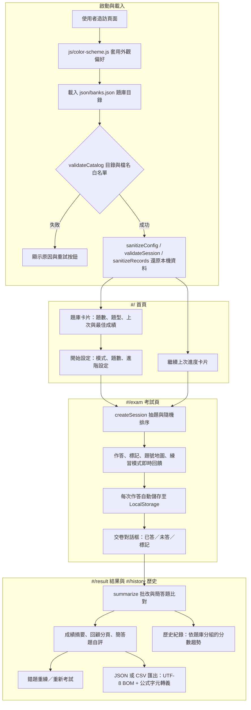
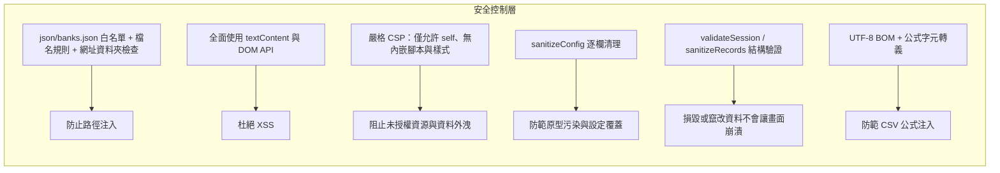
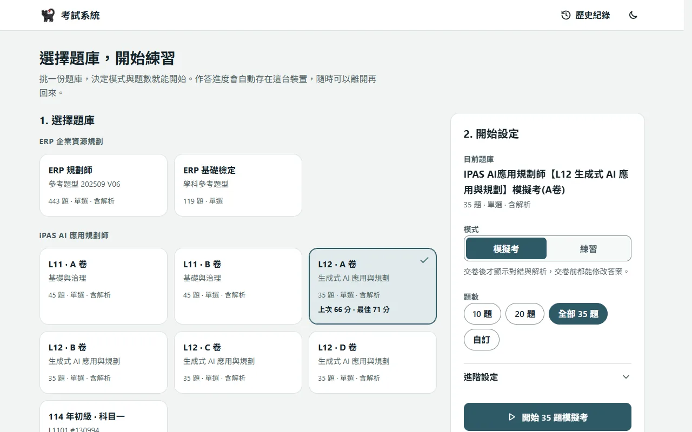
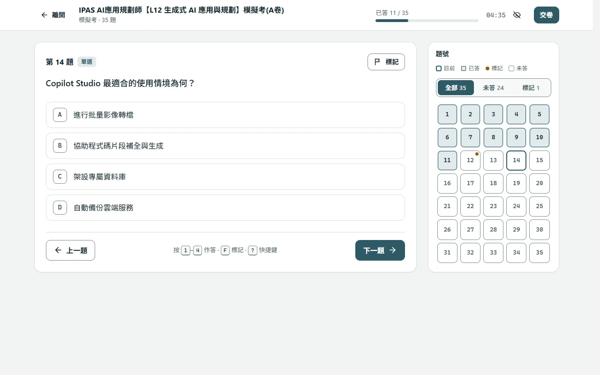
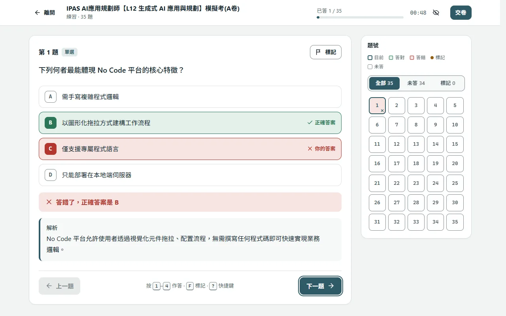
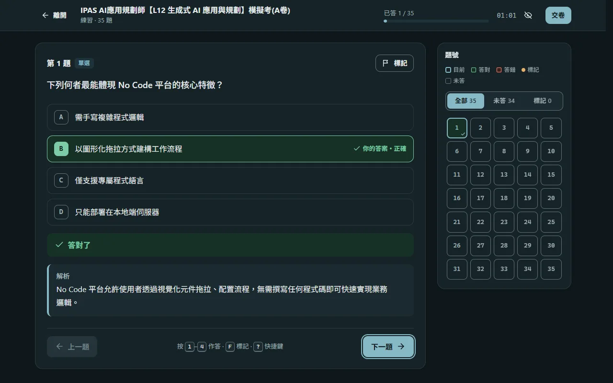
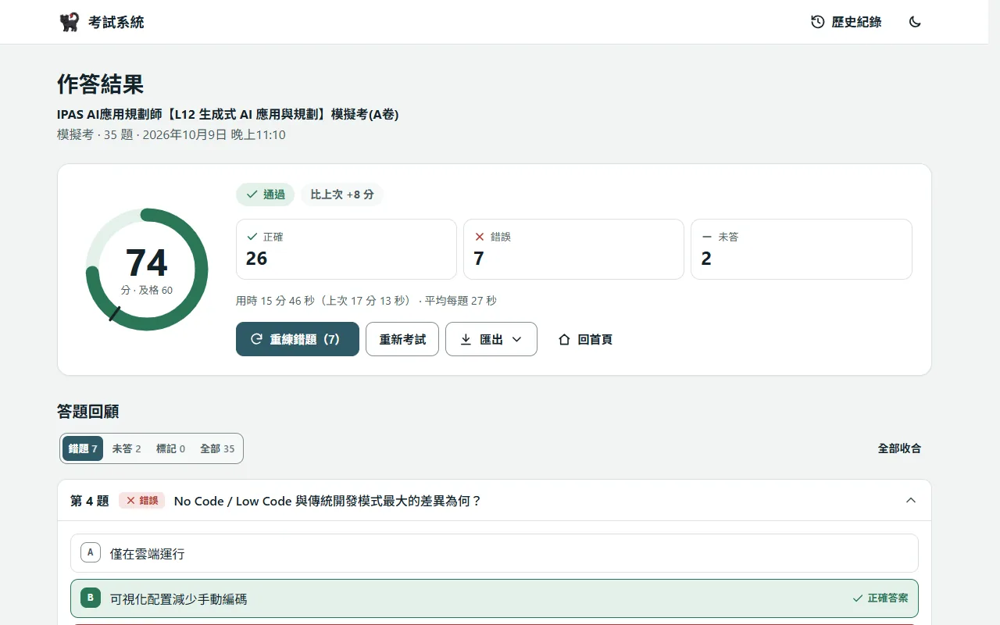
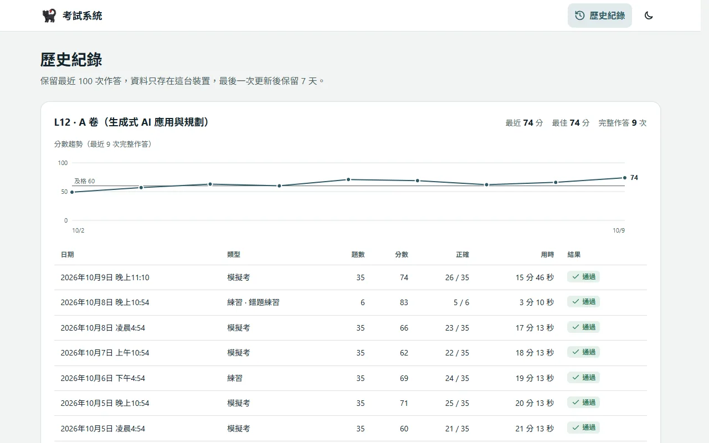
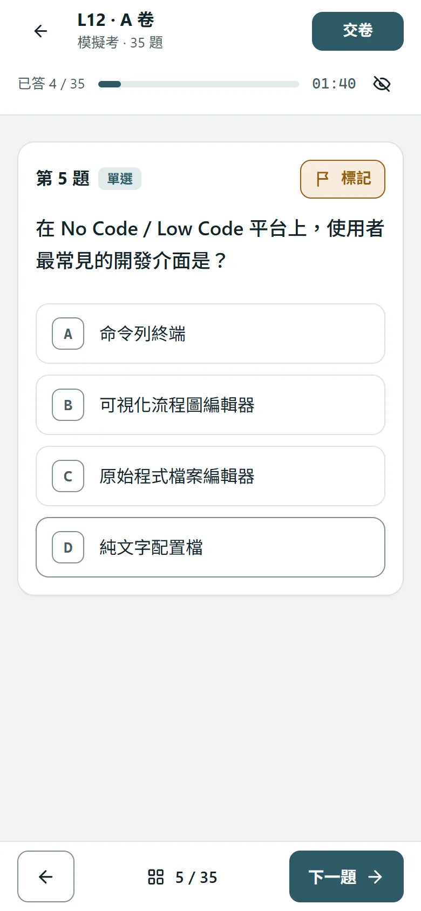
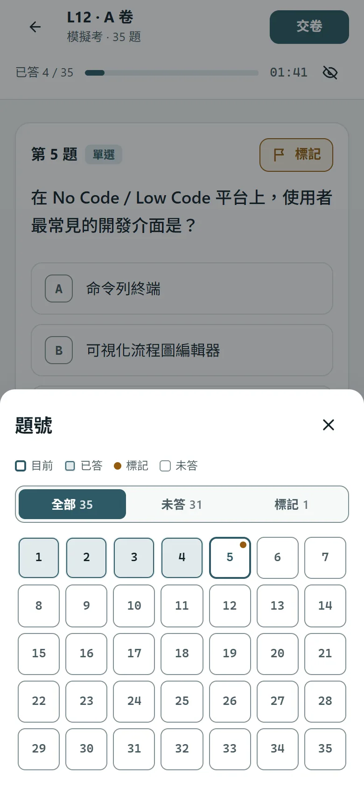

# 考試系統 (Examination System)

[English Version](README.en.md)

> 純前端、零執行期依賴的線上練習與模擬考平台：題庫卡片一鍵開始，支援模擬考與練習兩種模式、錯題重練、簡答題自評、進度自動保存、歷史趨勢、深淺色主題與防禦性資料匯出。

[](CHANGELOG.md)
[](LICENSE)
[](https://developer.mozilla.org/zh-TW/)
[-success?style=flat-square)](package.json)
[](docs/adr/ADR-002-frontend-architecture.md)
[](https://scorpio-meow.github.io/Examination-System/)
[](https://github.com/Scorpio-meow/Examination-System/issues)
[](https://github.com/Scorpio-meow/Examination-System/pulls)

---

## 目錄

- [快速開始](#快速開始)
- [線上試用](#線上試用)
- [系統架構與運作流程](#系統架構與運作流程)
- [功能特色](#功能特色)
- [題庫規格與資料統計](#題庫規格與資料統計)
- [設定選項規格](#設定選項規格)
- [鍵盤快捷鍵](#鍵盤快捷鍵)
- [資料結構規範](#資料結構規範)
- [檔案目錄結構](#檔案目錄結構)
- [安全防禦與架構限制](#安全防禦與架構限制)
- [介面預覽](#介面預覽)
- [開發與測試](#開發與測試)
- [疑難排解](#疑難排解)
- [常見問題](#常見問題)
- [版本記錄](#版本記錄)
- [貢獻指南](#貢獻指南)
- [聯絡方式](#聯絡方式)
- [授權條款](#授權條款)

---

## 快速開始

### 線上使用（推薦）

直接造訪 [https://scorpio-meow.github.io/Examination-System/](https://scorpio-meow.github.io/Examination-System/)，無需安裝任何伺服器或依賴套件。

### 本機執行

1. 複製或下載專案原始碼：
   ```bash
   git clone https://github.com/Scorpio-meow/Examination-System.git
   cd Examination-System
   ```

2. 啟動本機靜態網頁伺服器（必要步驟：瀏覽器不允許在 `file://` 協定下載入 ES modules 與題庫 JSON）：

   - **使用 Bun（推薦）**：
     ```bash
     bun x http-server -p 8000
     ```

   - **使用 Python 3**：
     ```bash
     python3 -m http.server 8000
     ```

   - **使用 Windows PowerShell**：
     ```powershell
     py -3 -m http.server 8000
     ```

3. 開啟瀏覽器造訪 [http://localhost:8000](http://localhost:8000)。

4. 在首頁點選題庫卡片，選擇「模擬考」或「練習」與題數後，按下「開始 N 題模擬考」即可作答。

> **重要提示**：請勿直接透過檔案總管雙擊 `index.html` 開啟，瀏覽器的跨來源安全限制會讓程式模組與題庫無法載入。

---

## 線上試用

本系統部署於 GitHub Pages，支援 HTTPS 加密傳輸與桌機、平板、手機的響應式介面：

**[https://scorpio-meow.github.io/Examination-System/](https://scorpio-meow.github.io/Examination-System/)**

可用 `?bank=` 參數直接選定題庫，例如 [`?bank=IPAS-AI-L12-A.json`](https://scorpio-meow.github.io/Examination-System/?bank=IPAS-AI-L12-A.json)。

---

## 系統架構與運作流程

本系統採純前端無伺服器（Serverless Client-Side）架構，以 ES modules 拆分職責，透過 hash 路由切換首頁、考試、結果與歷史紀錄四個畫面。完整的設計決策請參閱 [ADR-002：前端重構](docs/adr/ADR-002-frontend-architecture.md)。


```mermaid
flowchart TD
    subgraph Boot [啟動與載入]
        A[使用者造訪頁面] --> B[js/color-scheme.js 套用外觀偏好]
        B --> C[載入 json/banks.json 題庫目錄]
        C --> D{validateCatalog 目錄與檔名白名單}
        D -- 失敗 --> E[顯示原因與重試按鈕]
        D -- 成功 --> F[sanitizeConfig / validateSession / sanitizeRecords 還原本機資料]
    end

    subgraph Home ["#/ 首頁"]
        F --> G[題庫卡片：題數、題型、上次與最佳成績]
        G --> H[開始設定：模式、題數、進階設定]
        F --> I[繼續上次進度卡片]
    end

    subgraph Exam ["#/exam 考試頁"]
        H --> J[createSession 抽題與隨機排序]
        I --> J
        J --> K[作答、標記、題號地圖、練習模式即時回饋]
        K --> L[每次作答自動儲存至 LocalStorage]
        L --> M[交卷對話框：已答／未答／標記]
    end

    subgraph Result ["#/result 結果與 #/history 歷史"]
        M --> N[summarize 批改與簡答題比對]
        N --> O[成績摘要、回顧分頁、簡答題自評]
        O --> P[錯題重練／重新考試]
        O --> Q[JSON 或 CSV 匯出：UTF-8 BOM + 公式字元轉義]
        N --> R[歷史紀錄：依題庫分組的分數趨勢]
    end
```

---

## 功能特色

### 測驗與答題

| 功能模組 | 說明 |
|----------|------|
| 題庫卡片 | 11 套題庫依「ERP／iPAS AI／專業管理與理財」分組，卡片顯示短名、題數、題型、是否含解析與上次／最佳成績 |
| 兩種作答模式 | 「模擬考」交卷後才看答案；「練習」每題作答後立即顯示對錯與解析，答案隨即鎖定 |
| 彈性抽題 | 10／20／50／全部／自訂題數；題數超過題庫時自動隱藏，按鈕會寫明「開始 20 題模擬考」 |
| 隨機題序與選項 | 可隨機打亂題目與選項，選項打亂後自動重新對應正確答案 |
| 標記與題號地圖 | 按 <kbd>F</kbd> 標記題目；題號地圖顯示目前、已答、標記與未答，可只看未答或標記 |
| 交卷確認 | 「交卷」常駐頂部列，對話框列出已答、未答與標記數，可直接前往第一個未答題 |
| 計時 | 只計算停留在考試頁的時間，離開考試到繼續作答之間不計入；計時器可隱藏 |
| 行動裝置 | 固定底部操作列（上一題、題號、下一題），題號以底部抽屜開啟，觸控目標至少 44px |

### 結果分析與重練

| 功能模組 | 說明 |
|----------|------|
| 成績摘要 | 分數環依通過與否變色並標出及格線，顯示正確／錯誤／未答題數、用時與「比上次」分數差 |
| 答題回顧 | 依「錯題／未答／待自評／標記／全部」分頁；錯題預設展開，可全部展開或收合，每次顯示 50 題 |
| 錯題重練 | 一鍵以練習模式重做這次答錯的題目 |
| 簡答題自評 | 先以寬鬆比對（忽略全形、空白、大小寫與句尾標點）判定，比對不符的題目由使用者自評「我答對了／我答錯了」，分數即時更新 |
| 歷史紀錄 | 保留最近 100 次作答，依題庫分組顯示最近、最佳成績與分數趨勢圖 |

### 資料持久化與介面

| 功能模組 | 說明 |
|----------|------|
| 進度自動保存 | 每次作答即寫入 LocalStorage；「離開」或瀏覽器「上一頁」都會先保存再回首頁 |
| 繼續上次進度 | 首頁頂端顯示未完成進度（題庫、已答題數、開始時間），可繼續作答或放棄並重新開始 |
| 資料生命週期 (TTL) | 進度、最近結果、設定與歷史紀錄在最後一次更新後保留 7 天，逾期自動清除 |
| 深淺色主題 | 預設跟隨系統，頂部列可切換；所有顏色以 token 定義並通過 WCAG AA 對比 |
| 資料與隱私 | 頁尾「資料與隱私」說明保留規則，可在確認後清除所有本機資料並重置畫面 |
| 舊版資料轉換 | 升級時自動轉換 v3 的作答進度、設定與歷史紀錄 |

### 結果匯出欄位

| 匯出欄位 | 說明 | 格式範例 |
|----------|------|----------|
| 編號 | 本次作答的題目序號 | `1` |
| ID | 題庫原始識別碼 | `101` |
| 類型 | 題目型態 | `單選題` / `簡答題` |
| 題目 | 題目內文 | `專案的三大限制為何？` |
| 選項 | 選項組合文字 | `A. 範疇\nB. 時程\nC. 成本\nD. 品質` |
| 作答 | 使用者作答 | `A` |
| 解答 | 標準答案 | `A` |
| 是否正確 | 批改結果 | `是` / `否` / `待自評` |
| 解釋 | 題目解析 | `傳統專案管理三角形限制為範疇、時程與成本。` |
| 題庫標籤 | 題庫名稱 | `專案管理` |
| 匯出時間 | 匯出時間戳記 | `2026-10-09T10:15:30.000Z` |

- **CSV 防禦性編碼**：採用 `UTF-8 with BOM`，讓 Microsoft Excel 正確辨識中文；以 `=`, `+`, `-`, `@` 開頭的欄位自動前置單引號，阻擋 CSV 公式注入。
- **安全觸發下載**：以 `dispatchEvent(new MouseEvent(...))` 觸發 Blob 下載，不把暫時的 `<a>` 節點掛進文件；檔名使用題庫檔名，例如 `exam_result_ipas-ai-l12-a_20261009_221530.csv`。

---

## 題庫規格與資料統計

系統內建 11 套題庫，全部存放於 `./json/` 目錄，並由 [`json/banks.json`](json/banks.json) 統一管理分組、名稱與題數統計：

| 題庫名稱 | 檔案路徑 | 題數 | 領域範疇與重點摘要 |
|----------|----------|------|-------------------|
| ERP 規劃師 參考題型 | `json/ERP Planner_Reference Question Types_202509_V06.json` | 443 | 企業資源規劃架構、生產製造、配銷管理、財務會計與系統導入流程（含完整繁中解析） |
| ERP 基礎檢定 (學科) | `json/PFERP_Reference119_20240201.json` | 119 | 企業流程整合、生管、銷存、會計與 ERP 認證學科基礎題型 |
| iPAS AI 應用規劃師 L11 (A卷) | `json/IPAS-AI-L11-A.json` | 45 | AI 核心基礎、機器學習概念、演算法評估與 AI 治理法規標準 |
| iPAS AI 應用規劃師 L11 (B卷) | `json/IPAS-AI-L11-B.json` | 45 | 倫理隱私、資料治理、機器學習專案生命週期與模型驗證 |
| iPAS AI 應用規劃師 L1101 #130994 | `json/IPAS-AI-L11-130994.json` | 50 | 114 年度 iPAS AI 應用規劃師初級科目一官方公佈精選試題 |
| iPAS AI 應用規劃師 L12 (A卷) | `json/IPAS-AI-L12-A.json` | 35 | 生成式 AI 提示工程、大型語言模型 (LLM) 參數控制、RAG 架構設計 |
| iPAS AI 應用規劃師 L12 (B卷) | `json/IPAS-AI-L12-B.json` | 35 | 知識庫檢索增強、模型微調技術 (Fine-tuning)、向量資料庫應用 |
| iPAS AI 應用規劃師 L12 (C卷) | `json/IPAS-AI-L12-C.json` | 35 | AI 代理 (Agents) 工作流設計、評估指標與生成內容一致性管控 |
| iPAS AI 應用規劃師 L12 (D卷) | `json/IPAS-AI-L12-D.json` | 35 | 企業生成式 AI 落地架構、安全性驗證、成本優化與維運實務 |
| 專案管理 | `json/Project_Management.json` | 50 | PMI PMBOK 12 項原則、8 大專案績效領域與敏捷交付實務 |
| 理財規劃 | `json/Basic_Financial_Planning.json` | 151 | 家庭財務收支、投資理財策略、稅務規劃、保險與退休資產配置（單選 138 題、簡答 13 題） |

除 ERP 基礎檢定與理財規劃外，其餘 9 套題庫都附有逐題解析。

---

## 設定選項規格

首頁「開始設定」與「進階設定」中的選項會自動記住（儲存在 `examConfig`）：

| 參數 | 型別 | 預設值 | 可用選項 / 範圍 | 說明 |
|------|------|--------|-----------------|------|
| `bank` | String | `json/banks.json` 的 `defaultBank` | 題庫目錄中的檔名 | 目前選取的題庫；網址的 `?bank=` 優先 |
| `mode` | String | `exam` | `exam` / `practice` | 模擬考或練習模式 |
| `count` | String / Number | `all` | `10` / `20` / `50` / `all` / `custom` | 抽題數量 |
| `customCount` | Number | `20` | `1` ~ 題庫題數 | 選擇「自訂」時的題數 |
| `shuffleQuestions` | Boolean | `false` | `true` / `false` | 隨機排列題目順序 |
| `shuffleOptions` | Boolean | `false` | `true` / `false` | 隨機排列單選題選項 |
| `passingScore` | Number | `60` | `0` ~ `100` | 及格分數（開始作答時記錄在該次作答中） |
| `showExplanation` | Boolean | `true` | `true` / `false` | 練習模式作答後與成績回顧中是否顯示解析 |
| `showTimer` | Boolean | `true` | `true` / `false` | 考試頁是否顯示計時（考試中也可切換） |
| `shortcuts` | Boolean | `true` | `true` / `false` | 是否啟用單鍵快捷鍵（數字鍵、F、?） |

外觀偏好另存於 `color-scheme`，只有手動切換時才會寫入。

---

## 鍵盤快捷鍵

| 快捷鍵 | 作用情境 | 功能描述 |
|--------|----------|----------|
| <kbd>1</kbd> / <kbd>2</kbd> / <kbd>3</kbd> / <kbd>4</kbd> | 單選題 | 選取選項 A / B / C / D |
| <kbd>←</kbd> / <kbd>→</kbd> | 考試頁 | 上一題／下一題 |
| <kbd>Enter</kbd> | 考試頁 | 焦點不在按鈕或連結上時前往下一題；在按鈕上時觸發該按鈕。不會直接交卷 |
| <kbd>F</kbd> | 考試頁 | 標記或取消標記目前題目 |
| <kbd>?</kbd> | 考試頁 | 開啟快捷鍵說明 |
| <kbd>Esc</kbd> | 對話框 | 關閉對話框或題號抽屜 |

在簡答題輸入框中打字時快捷鍵不會作用；搭配 <kbd>Alt</kbd> / <kbd>Ctrl</kbd> / <kbd>⌘</kbd> 的組合鍵保留給瀏覽器。數字鍵、<kbd>F</kbd>、<kbd>?</kbd> 可在進階設定中關閉。

---

## 資料結構規範

### 題庫 JSON 格式

#### 單選題（Single Choice）

```json
[
  {
    "id": 1,
    "question": "在專案管理中，傳統專案三角形的三大限制要素為何？",
    "options": [
      "A. 範疇、時程、成本",
      "B. 品質、溝通、風險",
      "C. 人力、設備、資金",
      "D. 目標、計畫、執行"
    ],
    "answer": "A",
    "explanation": "傳統專案管理三角形的三大核心限制即為範疇 (Scope)、時程 (Time) 與成本 (Cost)。"
  }
]
```

#### 簡答題（Short Answer Question）

```json
[
  {
    "id": 2,
    "type": "SAQ",
    "question": "請說明 RAG (Retrieval-Augmented Generation) 技術的核心運作機制。",
    "answer": "檢索增強生成，透過結合外部知識庫檢索與大型語言模型生成，以提高回答精準度並降低幻覺。",
    "explanation": "RAG 先藉由向量檢索將相關文檔段落作為上下文注入 Prompt，再由 LLM 產生依據事實的答案。"
  }
]
```

- 選項前綴（`A.`、`B．`、`C、` 等）只有在字母與位置相符時才會被移除。
- 缺少題目內容、正確答案不在選項範圍內或題型不支援的題目會被略過，並在瀏覽器 console 列出原因；系統不會產生替代內容。

### 題庫目錄 `json/banks.json`

```json
{
  "defaultBank": "ERP Planner_Reference Question Types_202509_V06.json",
  "groups": [{ "id": "ipas", "title": "iPAS AI 應用規劃師" }],
  "banks": [
    {
      "file": "IPAS-AI-L12-A.json",
      "group": "ipas",
      "title": "IPAS AI應用規劃師【L12 生成式 AI 應用與規劃】模擬考(A卷)",
      "shortTitle": "L12 · A 卷",
      "subtitle": "生成式 AI 應用與規劃",
      "questionCount": 35,
      "typeCounts": { "single": 35, "saq": 0 },
      "explanationCount": 35
    }
  ]
}
```

`questionCount`、`typeCounts`、`explanationCount` 由 `bun run build:banks` 依題庫內容產生，其餘欄位手動維護。

---

## 檔案目錄結構

```
Examination-System/
├── index.html                  # 頁面骨架：頂部列、四個畫面、對話框與 SVG 圖示
├── app.js                      # 進入點：啟動、hash 路由與跨畫面流程
├── style.css                   # 樣式表（@layer 分層、淺色／深色 token）
├── js/
│   ├── color-scheme.js         # 防止外觀閃爍（同步載入的一般腳本）
│   ├── catalog.js              # 題庫目錄驗證與檔名白名單
│   ├── bank.js                 # 題庫下載與正規化
│   ├── session.js              # 抽題、作答、標記、批改與簡答題比對
│   ├── storage.js              # LocalStorage TTL、結構驗證與 v3 資料轉換
│   ├── history.js              # 歷史紀錄整理與題庫統計
│   ├── export.js               # JSON／CSV 匯出
│   ├── router.js               # hash 路由
│   ├── ui.js                   # 對話框、Toast 與選單
│   ├── theme.js                # 深淺色切換
│   ├── dom.js                  # 安全建立 DOM、格式化工具
│   └── views/                  # home.js、exam.js、result.js、history.js
├── json/
│   ├── banks.json              # 題庫目錄（白名單與統計）
│   └── *.json                  # 11 套題庫
├── assets/logo-64.png          # 頂部列 logo
├── favicon.png                 # 網站圖示原始檔（2048×2048，頁面不直接引用）
├── favicon-32.png              # 瀏覽器分頁圖示（32×32）
├── favicon-512.png             # 高解析度網站圖示（512×512）
├── apple-touch-icon.png        # iOS 主畫面圖示（180×180，不透明背景）
├── scripts/build-banks.js      # 產生／檢查題庫目錄統計
├── tests/                      # bun test 單元測試
├── package.json                # 開發腳本（無任何依賴）
├── CHANGELOG.md / CHANGELOG.en.md
├── README.md / README.en.md
├── llms.txt                    # 給大型語言模型與 AI 工具的專案索引
├── LICENSE                     # MIT 授權條款
└── docs/
    ├── screenshots/            # 介面截圖 (WebP)
    └── adr/                    # 架構決策記錄 ADR-001、ADR-002（中英文）
```

---

## 安全防禦與架構限制

防禦性設計的完整分析請參閱 [ADR-001：用戶端資料安全與防禦性驗證機制](docs/adr/ADR-001-local-security-validation.md) 與 [ADR-002：前端重構](docs/adr/ADR-002-frontend-architecture.md)。


```mermaid
graph LR
    subgraph Defenses [安全控制層]
        D1[json/banks.json 白名單 + 檔名規則 + 網址資料夾檢查] --> S1[防止路徑注入]
        D2[全面使用 textContent 與 DOM API] --> S2[杜絕 XSS]
        D3[嚴格 CSP：僅允許 self、無內嵌腳本與樣式] --> S3[阻止未授權資源與資料外洩]
        D4[sanitizeConfig 逐欄清理] --> S4[防範原型污染與設定覆蓋]
        D5[validateSession / sanitizeRecords 結構驗證] --> S5[損毀或竄改資料不會讓畫面崩潰]
        D6[UTF-8 BOM + 公式字元轉義] --> S6[防範 CSV 公式注入]
    end
```

### 架構邊界與使用定位說明

> **本系統定位為純前端自學與練習工具**：
> 1. 所有題庫與答案均以 JSON 格式公開存在於使用者瀏覽器端。
> 2. 所有批改均在用戶端 JavaScript 執行，不具備伺服器端防弊能力。
> 3. 本系統**不適用於**正式認證、升學競賽或高風險防弊測驗。

---

## 介面預覽

### 首頁：題庫卡片與開始設定



### 考試頁：題目卡與題號地圖



### 練習模式與深色主題





### 結果頁與歷史紀錄





### 行動裝置

<p>
  
  
</p>

---

## 開發與測試

開發工具使用 [Bun](https://bun.sh/)，網站本身不需要任何建置步驟。

```bash
bun test
```

```bash
bun run build:banks
```

```bash
bun run check:banks
```

- `bun test`：執行 `tests/` 內的單元測試（題庫正規化、目錄白名單、儲存驗證與舊版轉換、抽題與批改、歷史紀錄、CSV 防護）。
- `bun run build:banks`：依 `json/` 內容重新計算 `json/banks.json` 的題數統計，並列出尚未加入目錄的題庫檔。
- `bun run check:banks`：只檢查統計是否過期，過期時以非零狀態結束，適合在提交前執行。

---

## 疑難排解

| 常見症狀 | 可能原因 | 排除步驟與解決方案 |
|----------|----------|-------------------|
| 一直停在「正在載入題庫目錄」或顯示「無法載入題庫目錄」 | 以 `file://` 開啟，或伺服器沒有提供 `json/banks.json` | 依[快速開始](#快速開始)啟動本機伺服器；畫面上的「重試」會重新載入 |
| 開始設定顯示「題庫載入失敗」 | 網路中斷或題庫檔不存在 | 確認網路後按「重試」；新增題庫時請確認檔名已加入 `json/banks.json` |
| console 提示 `json/banks.json 的統計與 … 實際內容不符` | 題庫內容變更後未更新目錄統計 | 執行 `bun run build:banks` |
| 匯出的 CSV 在 Excel 開啟出現亂碼 | 舊版 Excel 未自動識別 UTF-8 | 使用 Excel「資料 > 從文字/CSV 匯入」，選擇「65001 : Unicode (UTF-8)」 |
| 快捷鍵沒有反應 | 正在輸入框中打字、開著對話框，或已在進階設定關閉單鍵快捷鍵 | 點一下題目區域後再試，或到首頁「進階設定」開啟 |
| 進度或歷史紀錄消失 | 使用無痕模式，或最後一次更新已超過 7 天 | 系統依賴 LocalStorage；長期練習請使用一般視窗 |
| 想清除所有資料重新開始 | 舊設定或紀錄干擾 | 點頁尾「資料與隱私」→「清除所有本機資料」 |

---

## 常見問題

**Q：「模擬考」和「練習」有什麼不同？**
A：模擬考交卷後才顯示對錯與解析，交卷前都能修改答案；練習模式每題作答後立即顯示對錯與解析，答案會鎖定，適合逐題學習。

**Q：簡答題怎麼計分？**
A：系統先做寬鬆比對（忽略全形與半形、空白、大小寫與句尾標點），相符就判定為正確；不相符的題目列為「待自評」，在結果頁並列你的答案與參考答案，由你按「我答對了／我答錯了」，分數與歷史紀錄會立即更新。

**Q：隨機打亂選項後，評分會不會出錯？**
A：不會。打亂時系統會依選項內容重新對應正確答案的字母，單元測試也涵蓋這個情境。

**Q：行動裝置或平板可以使用嗎？**
A：可以。手機版提供固定底部操作列與題號抽屜，觸控目標至少 44px；版面以 375px 寬的手機畫面驗收。

**Q：如何新增題庫？**
A：請完成三個步驟：
1. 依照[資料結構規範](#資料結構規範)將題庫 JSON 放入 `./json/`。
2. 在 `json/banks.json` 的 `banks` 加入一筆資料（`file`、`group`、`title`、`shortTitle`，可選 `subtitle`）。
3. 執行 `bun run build:banks` 產生題數統計，重新整理頁面即可看到新的題庫卡片。

---

## 版本記錄

完整版本更新資訊請參閱 [CHANGELOG.md](CHANGELOG.md)。

- **最新版本**：`v4.0.0` (2026-10-09)
  - 全新介面與設計系統：題庫卡片、開始設定、淺色／深色主題
  - 練習模式、錯題重練、標記、題號地圖、交卷確認與手機底部操作列
  - 結果頁回顧分頁、簡答題自評與歷史趨勢圖
  - ES modules 架構、hash 路由、`json/banks.json` 題庫目錄與單元測試
- **主要歷程**：
  - `v3.5.2`：補全 ERP 規劃師參考題型解析、統一題庫路徑至 `json/`
  - `v3.5.1`：引入題庫白名單機制、LocalStorage Schema 防禦審查、CSP 收緊與安全下載觸發
  - `v3.5.0`：新增隨機抽題設定、多套 ERP 題庫支援、UI 現代化與精簡重構
  - `v3.4.1`：引進條件化 Logger、隱私說明與防弊邊界提示
  - `v3.3.2`：新增 IPAS AI 系列題庫、題號導覽側邊欄、CSV/JSON 匯出與 LocalStorage TTL

---

## 貢獻指南

歡迎參與題庫擴充、架構精進與功能優化：

1. 前往專案儲存庫 Fork 本專案至個人帳號。
2. 建立功能分支：`git checkout -b feature/your-feature-name`。
3. 修改後執行 `bun test` 與 `bun run check:banks` 確認通過。
4. 撰寫清晰的 Conventional Commits：`git commit -m 'feat: 新增某專業題庫'`。
5. 推送至遠端分支：`git push origin feature/your-feature-name`。
6. 開啟 Pull Request 並說明變更細節與測試結果。

---

## 聯絡方式

| 管道 | 徽章與連結 |
|------|------------|
| **電子郵件** | [](mailto:yao921024@gmail.com) |
| **Instagram** | [](https://www.instagram.com/scorpio_meow_1024) |
| **Threads** | [](https://www.threads.com/@scorpio_meow_1024) |
| **問題回報** | [](https://github.com/Scorpio-meow/Examination-System/issues) |
| **協作開發** | [](https://github.com/Scorpio-meow/Examination-System/pulls) |
| **專案首頁** | [](https://github.com/Scorpio-meow/Examination-System) |

---

## 授權條款

本專案採用 [MIT License](LICENSE) 授權條款釋出。