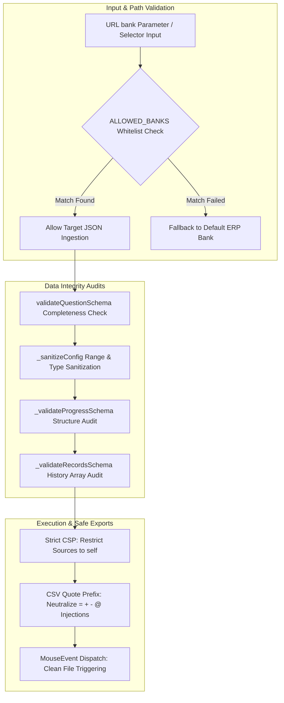

# ADR-001: Client-Side Data Security and Defensive Verification Mechanism

## Status
Accepted

## Context
In previous architectural iterations, the Examination System operated as a static client-side web application with several latent security weaknesses and defensive omissions:
1. **Question Bank Path Injection**: The path to load question bank files was directly ingested from the URL `bank` query parameter or dropdown selectors without validation, risking attempts to load unintended local files.
2. **Unvalidated LocalStorage State Restoration**: Active progress records (`examProgress`) and history archives (`examRecords`) were deserialized and applied without schema validation or boundary checks. Corrupted or tampered local states could trigger out-of-bounds exceptions or runtime crashes.
3. **Prototype Pollution & Configuration State Contamination**: System configuration restoration used direct object spread operators (`{ ...config, ...savedConfig }`), exposing internal state variables to untrusted property overrides.
4. **Permissive Content Security Policy (CSP)**: The legacy CSP rule included `data:` URIs for images and fonts, increasing potential attack surfaces for Cross-Site Scripting (XSS) and data exfiltration.
5. **DOM Mutation & CSV Command Injection**: Exporting CSV files without escaping leading math symbols posed command injection risks in spreadsheet applications; inserting temporary download anchors directly into the DOM tree introduced DOM mutation vectors.

To reinforce the resilience, runtime stability, and defensive posture of this self-study examination tool, we decided to implement client-side defensive validation controls.

---

## Decision
We decided to integrate multi-layered defensive verification structures within `app.js` and `index.html`:

### Key Implementation Details

1. **Static Question Bank Whitelist (`ALLOWED_BANKS`)**:
   Declared a global `ALLOWED_BANKS` Set. All bank initialization and runtime switching routines strictly match against this whitelist. Unrecognized filenames immediately fallback to the default bank.

2. **Safe Configuration Deserializer (`_sanitizeConfig`)**:
   Implemented an explicit deserialization sanitizer. Properties are individually inspected for expected types and valid numerical ranges (e.g., `passingScore` restricted between 0–100, `drawQuestionCount` constrained to recognized enum limits), replacing direct object spread merges.

3. **Progress & History Schema Verification (`_validateProgressSchema`, `_validateRecordsSchema`)**:
   Before restoring saved progress or historical analytics from LocalStorage, the application audits array lengths, index bounds, and answer formats. Corrupted or expired data (past the 7-day TTL) is safely discarded without crashing the UI.

4. **Hardened Content Security Policy (CSP)**:
   Removed `data:` URI allowances from `img-src` and `font-src` within the `index.html` CSP header, restricting resource origins to `'self'`.

5. **Safe Download Dispatching & CSV Protection**:
   CSV and JSON exports are initiated programmatically via `dispatchEvent(new MouseEvent('click'))` without attaching elements to `document.body`. Cells beginning with `=`, `+`, `-`, or `@` are automatically escaped with a leading single quote.

---

## Comparison Matrix

| Evaluation Dimension | Legacy Architecture | Hardened Defensive Architecture | Security & Stability Benefit |
|----------------------|---------------------|---------------------------------|------------------------------|
| **Bank Loading Path** | Direct fetch from user input | Verified against `ALLOWED_BANKS` | Eliminates arbitrary path injection |
| **Configuration Loading** | Object spread `{ ...config, ...saved }` | Sanitized via `_sanitizeConfig()` | Prevents prototype pollution and overrides |
| **LocalStorage Ingestion** | Direct parsing without validation | Verified via `_validateProgressSchema` | Guards against runtime crashes on bad data |
| **Data Lifecycle** | Indefinite persistence | Automated 7-Day TTL Expiration | Minimizes local storage data leakage |
| **Content Security Policy** | Allowed `data:` URIs | Strict `'self'` resource boundary | Reduces data exfiltration and XSS vectors |
| **Export File Trigger** | Injected `<a>` element into body | Dispatched via `MouseEvent` | Prevents temporary DOM tree mutation |
| **CSV Generation** | Raw string concatenation | UTF-8 with BOM + Quote Escaping | Neutralizes spreadsheet command injection |

---

## Consequences

### Positive Impacts
- **High Runtime Resilience**: The application remains operational and gracefully recovers even if LocalStorage data is corrupted by external utilities or power interruptions.
- **Robust Client-Side Defense**: Neutralizes path injection, prototype pollution, CSV command injection, and DOM contamination vectors.
- **Zero-Maintenance Privacy**: Built-in 7-day TTL ensures that local study data does not accumulate indefinitely in user browsers.

### Trade-offs & Constraints
- **Minor Developer Overhead**: Adding a new question bank requires registering its filename both in `index.html` and in the `ALLOWED_BANKS` whitelist within `app.js`.
- **Architectural Scope Boundary**: Because all validation occurs on the client, question banks and solutions remain publicly inspectable in the browser. The tool remains dedicated to self-paced learning rather than proctored assessments.