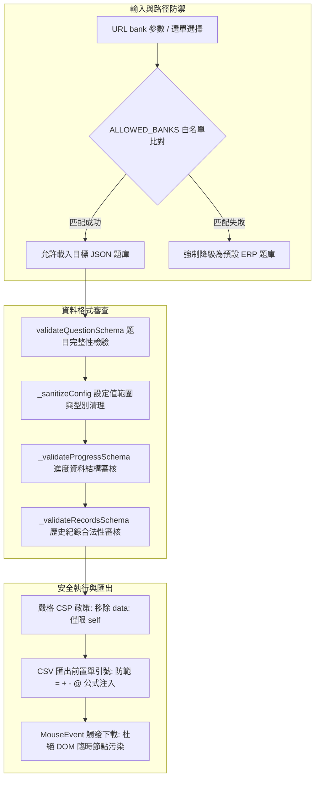

# ADR-001: 用戶端資料安全與防禦性驗證機制

## 狀態
已接受 (Accepted)

## 上下文 (Context)
在先前的版本架構中，考試系統作為純前端靜態應用程式，存在數個潛在的安全隱患與防禦缺陷：
1. **題庫路徑注入風險**：系統載入題庫之路徑可直接透過 URL 的 `bank` 參數或題庫選擇器傳入，未經驗證可能嘗試載入非預期的本地檔案或異常路徑。
2. **LocalStorage 資料損毀與邏輯異常**：考試進度（`examProgress`）與歷史紀錄（`examRecords`）在恢復時，未經結構與欄位合法性審查便直接讀取使用，若使用者本機資料損毀或被篡改，易導致陣列存取越界或系統崩潰。
3. **配置狀態與原型污染風險**：載入設定值時直接採用物件展開合併（`{ ...config, ...savedConfig }`），外部傳入之未知欄位可能污染內部狀態。
4. **內容安全政策 (CSP) 範圍過寬**：原 CSP 政策中允許了 `data:` URI，增加了潛在的跨站腳本 (XSS) 與資料外洩攻擊面。
5. **DOM 污染與匯出注入風險**：匯出 CSV 時若未進行特殊符號轉義，可能引發試算表公式注入（CSV Command Injection）；若將臨時下載連結插入 DOM 樹，可能造成 DOM 結構污染。

為強化純前端知識練習工具的穩定性、可用性與防禦深度，我們需要在瀏覽器用戶端實施完整的防禦性架構。

---

## 決策 (Decision)
我們決定在 `app.js` 與 `index.html` 中引入多層防禦性驗證機制：

### 具體實施項目

1. **題庫來源靜態白名單 (`ALLOWED_BANKS`)**：
   在全域宣告 `ALLOWED_BANKS` 的 `Set` 集合，所有題庫切換與 URL 參數解析均必須完全符合白名單內之檔案名稱，否則一律退回預設題庫。

2. **設定載入清理函式 (`_sanitizeConfig`)**：
   實作安全的反序列化清理機制，逐欄審查型別與合法範圍（如 `passingScore` 限制於 0–100，`drawQuestionCount` 僅允許白名單數值），取代原先直接展開合併物件之做法。

3. **進度與歷史結構審查 (`_validateProgressSchema`, `_validateRecordsSchema`)**：
   在從 LocalStorage 讀取作答進度前，審驗陣列格式、索引型別與選項邊界；在審驗失敗或資料過期（超過 7 天 TTL）時自動清除無效資料，確保系統永不崩潰。

4. **收緊內容安全政策 (CSP)**：
   於 `index.html` 的 `<meta http-equiv="Content-Security-Policy">` 中移除 `img-src` 與 `font-src` 的 `data:` 支援，限制所有資源僅能由 `'self'` 載入。

5. **安全觸發檔案匯出**：
   在產出 CSV 與 JSON 檔案時，使用 `dispatchEvent(new MouseEvent('click'))` 進行背景觸發下載，避免在 `document.body` 中掛載 `<a>` 標籤；對所有 CSV 儲存格資料開頭若包含 `=`, `+`, `-`, `@` 者自動前置單引號 `'`。

---

## 決策對照表 (Comparison)

| 評估維度 | 原有架構實作 | 防禦性強化後實作 | 安全效益 |
|----------|--------------|------------------|----------|
| **題庫載入路徑** | 直接依據 URL 或下拉值 Fetch | `ALLOWED_BANKS` 白名單比對後載入 | 杜絕任意路徑遍歷與非預期檔案載入 |
| **設定值合併** | `{ ...config, ...savedConfig }` | `_sanitizeConfig()` 逐欄嚴格型別審查 | 防範原型污染與非預期屬性注入 |
| **LocalStorage 讀取** | 直接 `JSON.parse` 後套用 | `_validateProgressSchema` 驗證結構與邊界 | 避免損毀或惡意進度導致執行期崩潰 |
| **資料生命週期** | 永久留存於本機儲存空間 | 實作 7 天 TTL 自動過期清理機制 | 降低本機隱私資料殘留風險 |
| **CSP 規範** | 允許 `data:` URI 載入字體與圖檔 | 僅允許 `'self'` 來源 | 降低資料外洩與惡意 Payload 注入風險 |
| **檔案下載方式** | `document.body.appendChild(a)` | `dispatchEvent(new MouseEvent(...))` | 杜絕 DOM 樹臨時節點污染 |
| **CSV 內容匯出** | 純文字串接輸出 | UTF-8 with BOM + 公式字元轉義 | 防止 Excel 開啟時執行惡意公式指令 |

---

## 結果與權衡 (Consequences)

### 正面效益 (Positive)
- **極致的穩定性與容錯力**：即使使用者端的 LocalStorage 資料遭到外部工具破壞或異常斷電損毀，系統仍能自動識別並重置，保障答題流程正常運作。
- **強固的用戶端防禦能力**：有效封閉了路徑注入、CSV 公式注入、原型污染及 XSS 擴散等常見前端安全弱點。
- **高隱私與免維護**：內建的 7 天 TTL 自動清理機制讓本機資料具備合理的生命週期，不需使用者手動介入即可維護純淨的儲存空間。

### 權衡與限制 (Trade-offs & Constraints)
- **開發維護成本微幅增加**：後續若新增題庫檔案，開發者除在 `index.html` 下拉選單加入選項外，必須同步將檔名註冊至 `app.js` 的 `ALLOWED_BANKS` 白名單中。
- **架構本質定位不變**：所有驗證皆在瀏覽器端執行，題庫與答案仍公開存在於前端，本系統仍維持為「個人自主練習工具」，不適用於需防弊之正式遠端測驗場景。