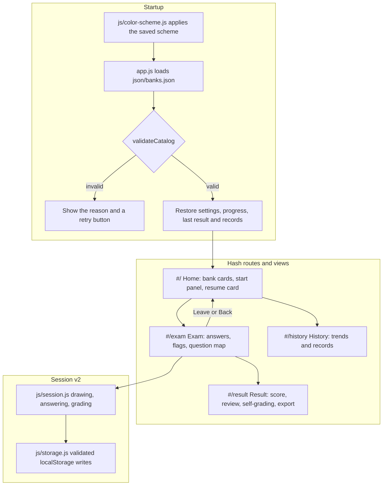

# ADR-002: Front-end Rewrite — Modules, Bank Catalog and Accessible Interaction Model

[繁體中文版](ADR-002-frontend-architecture.md)

## Status
Accepted, effective from v4.0.0. The bank whitelist implementation supersedes item 1 of [ADR-001](ADR-001-local-security-validation.en.md); the remaining defenses are kept and extended.

## Context
The UI/UX review of v3.5.2 found 6 flow-breaking P0 issues and 31 P1–P3 issues. Most of them came from the architecture:

1. **A single 1,700-line `app.js`**: state, storage, views and events all lived in the `ExamApp` class, so changing one flow affected others (for example, restored progress was sent back to the home page by `init()`).
2. **A global keyboard handler**: the exam page intercepted every Enter key and skipped all shortcuts when a radio button had focus, which broke the question-number buttons and let arrow keys change answers.
3. **A duplicated bank list**: the `<select>` in `index.html` and `ALLOWED_BANKS` in `app.js` were maintained separately, and the home page could not show question counts or types without downloading the banks.
4. **Answers keyed by question `id`**: the ERP Planner bank contains 2 duplicated ids, so those answers overwrote each other.
5. **Native `confirm()` / `alert()`**: unstyled, shown before the page had rendered, and without focus management.
6. **No routing**: there was no way to leave an exam, and the browser Back button either left the site or wiped progress.

## Decision

### 1. Split into ES modules with zero runtime dependencies
`app.js` is now the entry point that handles startup, routing and cross-view flows; the logic lives in `js/`:

| Module | Responsibility |
|--------|----------------|
| `js/catalog.js` | Catalog validation, filename whitelist, bank URL resolution |
| `js/bank.js` | Downloads and normalizes banks; invalid questions are skipped and reported, never replaced with placeholders |
| `js/session.js` | Drawing, shuffling, answering, flags, practice-mode locking, grading and short-answer matching |
| `js/storage.js` | 7-day TTL storage, validation of every stored structure, v3 data migration |
| `js/history.js` / `js/export.js` | History aggregation, JSON / CSV export |
| `js/router.js` / `js/ui.js` / `js/theme.js` / `js/dom.js` | Routing, dialogs and toasts, color scheme, safe DOM building |
| `js/views/*.js` | The home, exam, result and history views |

The pure logic modules never touch the DOM, so they are tested directly with `bun test`. The site is still a set of static files deployable to GitHub Pages; `package.json` only holds development scripts and has no dependencies.

### 2. Hash routing
Routes are `#/`, `#/exam`, `#/result` and `#/history`. Starting an exam from home stores the origin in `history.state`, so both "Leave" and the browser Back button save progress before returning home. Submitting replaces the exam entry with `replaceState`, so Back from the result page returns home instead of to a finished exam. Changing banks only updates `?bank=` with `replaceState` and no longer creates history entries that used to wipe progress.

### 3. `json/banks.json` becomes the whitelist
The catalog holds hand-maintained fields (group, title, short title) plus question counts, type counts and explanation counts generated by `bun run build:banks`. The security boundary now has three layers: the file is listed in the catalog, the name matches `^[A-Za-z0-9][A-Za-z0-9 _.-]*\.json$` (no slashes, no `..` paths, no query strings), and the resolved URL stays inside the `json/` folder. If a loaded bank's real counts differ from the catalog, the UI uses the real content and the console asks the developer to regenerate the statistics.

### 4. Session v2
Every question gets a unique key `q<index in bank>` for its answer, and the session also stores flags, questions already checked in practice mode, short-answer self-grades, actual answering time and the passing score at start. Progress and the last result share this structure and are fully validated when read. v3 `examProgress`, `examConfig` and `examRecords` are migrated automatically; anything that cannot be fully understood is discarded instead of guessed.

### 5. Native `<dialog>` instead of confirm / alert; no Popover or Invoker Commands
Confirmation, submission, the shortcut guide, data & privacy and the mobile question map all use `showModal()`, so the browser handles focus containment and Escape, and focus returns to the trigger on close. `closedby="any"` is not widely available yet, so a coordinate check provides backdrop-click dismissal as a fallback. The Popover API and Invoker Commands are still "newly available" and the CSP forbids loading polyfills from a CDN, so the export menu is an `aria-expanded` disclosure button and toasts use a fixed `role="status"` region.

### 6. Dark mode overrides tokens only
`<meta name="color-scheme">` defaults to `light dark`, and CSS maps manual overrides with `:root:has(> head > meta[content="dark"])`. Because the CSP blocks inline scripts, the anti-flash code lives in the synchronously loaded external file `js/color-scheme.js`. `light-dark()` is not widely available yet, so the tokens are declared in duplicated blocks instead.

### 7. Accessible interaction model
Options are native radio buttons in a `fieldset` labelled by the question stem via `aria-labelledby`, so one click records one answer. Left and right arrows change questions while up and down keep the native radio behavior, and Enter is left to buttons and links when they have focus. Single-key shortcuts can be turned off in the advanced settings (WCAG 2.1.4). Focus moves to the page heading after navigation, question changes are announced through `aria-live`, touch targets are at least 44px, and `prefers-reduced-motion` is respected.

## Comparison

| Aspect | v3.5.2 | v4.0.0 | Benefit |
|--------|--------|--------|---------|
| Code structure | One `ExamApp` class | 10 shared modules + 4 view modules | Predictable change scope, unit-testable logic |
| Bank list | `<select>` and `ALLOWED_BANKS` | `json/banks.json` single source + stats script | One place to add a bank; home shows counts without downloading banks |
| Answer keys | Question `id` | Index-based `q<n>` | Duplicated ids no longer overwrite each other |
| Dialogs | Native confirm / alert | `<dialog>` + toasts | Styled, predictable focus, no render blocking |
| Navigation | View toggling, no routes | Hash routes + auto-save | Predictable Back button, deep links to every view |
| Appearance | Light only | Light / dark tokens with a manual toggle | Comfortable at night, follows system changes live |
| Verification | Manual testing | 98 unit tests; E2E, axe and Lighthouse during acceptance | Regressions are caught automatically |

## Consequences

### Positive
- All 6 P0 and 31 P1–P3 issues from the review are resolved, and axe (WCAG 2.2 A / AA + best-practice) reports 0 violations on every view.
- Clear boundaries between banks, session state, storage and views let features such as practice mode, wrong-answer drills and short-answer self-grading be added without touching other views.

### Trade-offs & Constraints
- After adding or editing a bank, run `bun run build:banks` to refresh the catalog statistics; `bun run check:banks` detects stale statistics before committing.
- More files mean several module requests on first load; the impact is small with HTTP/2 and caching, and opening `index.html` through `file://` is still unsupported (v3 also required a local server).
- The app relies on widely available features such as `:has()`, `<dialog>` and ES modules, so browser versions from before 2023 are not supported.
- The positioning is unchanged: questions and answers remain public in the browser, so this is a personal practice tool and not suitable for proctored exams.