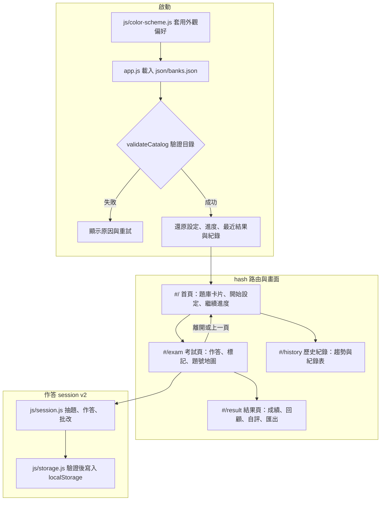

# ADR-002: 前端重構——模組化、題庫目錄與無障礙互動模型

[English Version](ADR-002-frontend-architecture.en.md)

## 狀態
已接受 (Accepted)，v4.0.0 起生效。題庫白名單的實作方式取代 [ADR-001](ADR-001-local-security-validation.md) 第 1 點，其餘防禦機制沿用並延伸。

## 上下文 (Context)
v3.5.2 的 UI/UX 檢查發現 6 個會中斷流程的 P0 問題與 31 項 P1–P3 問題，根源集中在架構：

1. **單一 1,700 行的 `app.js`**：狀態、儲存、畫面與事件全部集中在 `ExamApp` 類別，修改任一流程都容易牽動其他畫面（例如恢復進度後被 `init()` 送回首頁）。
2. **全域鍵盤處理器**：考試頁攔截所有 Enter、焦點落在 radio 時略過全部快捷鍵，導致題號按鈕失效與方向鍵改答案。
3. **題庫清單重複維護**：`index.html` 的 `<select>` 與 `app.js` 的 `ALLOWED_BANKS` 各維護一份，且首頁無法在不下載題庫的情況下顯示題數與題型。
4. **答案以題目 `id` 為鍵**：ERP 規劃師題庫有 2 組重複 id，作答會互相覆蓋。
5. **原生 `confirm()`／`alert()`**：無法套樣式、在頁面渲染前就跳出，且沒有焦點管理。
6. **沒有路由**：考試中沒有離開入口，瀏覽器「上一頁」直接離站或清除進度。

## 決策 (Decision)

### 1. 以 ES modules 拆分，維持零執行期依賴
`app.js` 改為進入點，只負責啟動、路由與跨畫面流程；邏輯拆到 `js/`：

| 模組 | 職責 |
|------|------|
| `js/catalog.js` | 驗證題庫目錄、檔名白名單、解析題庫網址 |
| `js/bank.js` | 下載與正規化題庫，不合格題目直接略過並回報，不產生替代內容 |
| `js/session.js` | 抽題、隨機排序、作答、標記、練習模式鎖定、批改與簡答題比對 |
| `js/storage.js` | 7 天 TTL 存取、所有存檔資料的結構驗證、v3 資料轉換 |
| `js/history.js`／`js/export.js` | 歷史紀錄整理、JSON／CSV 匯出 |
| `js/router.js`／`js/ui.js`／`js/theme.js`／`js/dom.js` | 路由、對話框與 Toast、深淺色、安全建立 DOM |
| `js/views/*.js` | 首頁、考試、結果、歷史四個畫面 |

純邏輯模組不碰 DOM，可以直接用 `bun test` 測試。網站仍是可直接部署到 GitHub Pages 的靜態檔案，`package.json` 只有開發腳本、沒有任何依賴。

### 2. hash 路由
使用 `#/`、`#/exam`、`#/result`、`#/history`。從首頁進入考試時把來源記在 `history.state`，「離開」或瀏覽器「上一頁」都會先保存進度再回首頁；交卷以 `replaceState` 取代考試頁紀錄，結果頁按上一頁會回到首頁而不是已結束的考試。換題庫只用 `replaceState` 更新 `?bank=`，不再產生會觸發清除進度的歷史紀錄。

### 3. 題庫目錄 `json/banks.json` 成為白名單
目錄同時記錄人工維護的欄位（分組、標題、短名）與 `bun run build:banks` 產生的題數、題型與解析統計。安全邊界改為三層：目錄中有列出、檔名符合 `^[A-Za-z0-9][A-Za-z0-9 _.-]*\.json$`（不允許斜線、`..` 路徑與查詢字串）、解析後的網址仍位於 `json/` 資料夾內。載入題庫時若實際題數與目錄不符，畫面改用實際內容並在 console 提示重新產生統計。

### 4. 作答 session v2
每題使用唯一鍵 `q<題庫內序號>` 記錄答案，同時保存標記、練習模式已核對的題目、簡答題自評、實際作答時間與當時的及格分數。進度、最近一次結果都以同一份結構保存並在讀取時完整驗證；v3 的 `examProgress`、`examConfig`、`examRecords` 會自動轉換，無法完整辨識的資料直接捨棄，不猜測。

### 5. 原生 `<dialog>` 取代 confirm／alert，不採用 Popover 與 Invoker Commands
確認、交卷、快捷鍵說明、資料與隱私、手機題號抽屜都使用 `showModal()`，由瀏覽器處理焦點限制與 Esc；關閉後焦點回到觸發按鈕。`closedby="any"` 尚未普及，另以座標判斷提供點擊背景關閉的退路。Popover API 與 Invoker Commands 仍屬「新近可用」，而 CSP 禁止從 CDN 載入 polyfill，因此匯出選單改用 `aria-expanded` 揭露按鈕，Toast 使用固定位置的 `role="status"` 區域。

### 6. 深色模式只覆寫 token
`<meta name="color-scheme">` 預設為 `light dark`，CSS 以 `:root:has(> head > meta[content="dark"])` 對應手動切換。因為 CSP 不允許內嵌腳本，防止閃爍的程式放在同步載入的外部檔 `js/color-scheme.js`。`light-dark()` 尚未達到廣泛可用，改以重複的 token 區塊實作。

### 7. 無障礙互動模型
選項使用原生 radio 與 `fieldset`（以 `aria-labelledby` 指向題幹），一次點擊只觸發一次作答；方向鍵左右換題、上下仍是原生 radio 行為；焦點在按鈕或連結上時 Enter 交給該元素。單鍵快捷鍵可在進階設定關閉（WCAG 2.1.4）。換頁後焦點移到該頁標題，題目變更透過 `aria-live` 通告；觸控目標至少 44px，並尊重 `prefers-reduced-motion`。

## 決策對照表 (Comparison)

| 評估維度 | v3.5.2 | v4.0.0 | 效益 |
|----------|--------|--------|------|
| 程式結構 | 單一 `ExamApp` 類別 | 10 個共用模組 + 4 個畫面模組 | 修改範圍可預期，邏輯可單元測試 |
| 題庫清單 | `<select>` 與 `ALLOWED_BANKS` 兩份 | `json/banks.json` 單一來源 + 統計腳本 | 新增題庫只改一處，首頁不必下載題庫即可顯示題數 |
| 答案鍵值 | 題目 `id` | 題庫內序號 `q<n>` | 重複 id 不再互相覆蓋 |
| 對話框 | 原生 confirm／alert | `<dialog>` + Toast | 可套樣式、焦點可預期、不阻塞渲染 |
| 導覽 | 單頁切換，無路由 | hash 路由 + 自動保存 | 上一頁可預期，可直接連到各畫面 |
| 外觀 | 只有淺色 | 淺色／深色 token，可手動切換 | 夜間使用舒適，系統設定即時生效 |
| 驗證方式 | 人工測試 | 98 項單元測試；驗收時另跑 E2E、axe、Lighthouse | 回歸問題可自動發現 |

## 結果與權衡 (Consequences)

### 正面效益 (Positive)
- 報告列出的 6 項 P0 與 31 項 P1–P3 問題都在新架構下處理完成，axe（WCAG 2.2 A／AA + best-practice）掃描各畫面 0 違規。
- 題庫、作答狀態、儲存與畫面之間的界線清楚，新增功能（例如練習模式、錯題重練、簡答自評）不需要修改其他畫面。

### 權衡與限制 (Trade-offs & Constraints)
- 新增或修改題庫後必須執行 `bun run build:banks` 更新目錄統計；`bun run check:banks` 可在提交前檢查是否過期。
- 檔案數量增加，首次載入需要多個模組請求；在 HTTP/2 與瀏覽器快取下影響很小，但不支援以 `file://` 直接開啟（v3 同樣需要本機伺服器）。
- 依賴 `:has()`、`<dialog>`、ES modules 等廣泛可用的功能，不支援 2023 年以前的瀏覽器版本。
- 架構定位不變：題目與答案仍公開於瀏覽器端，本系統仍是個人練習工具，不適用於需要防弊的正式考試。